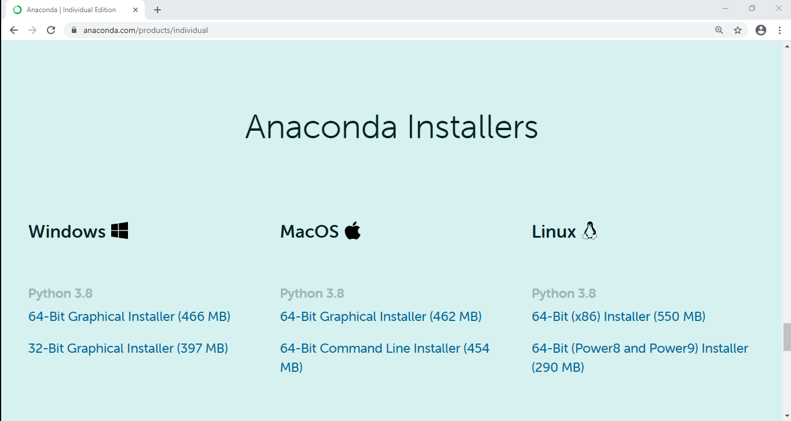
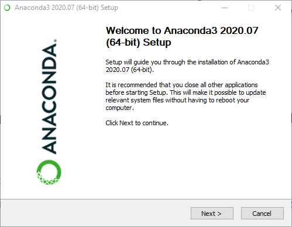
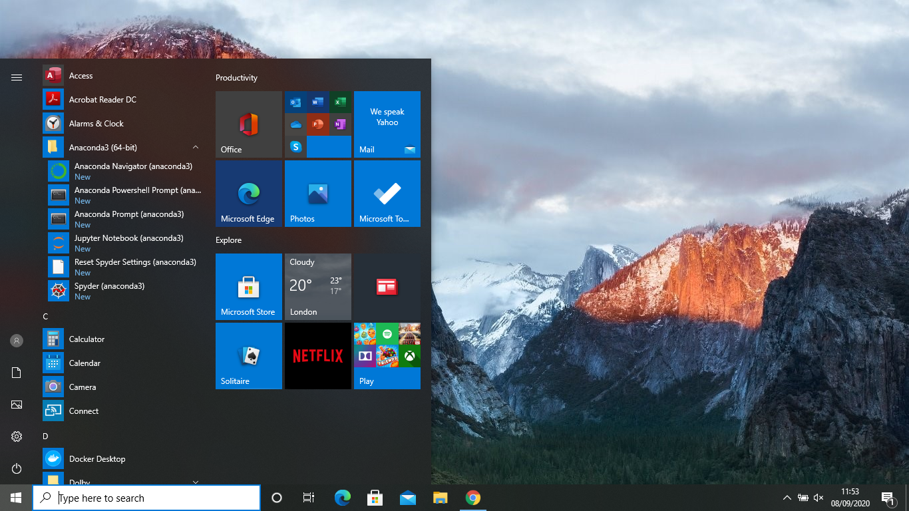
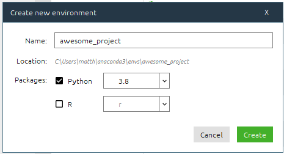
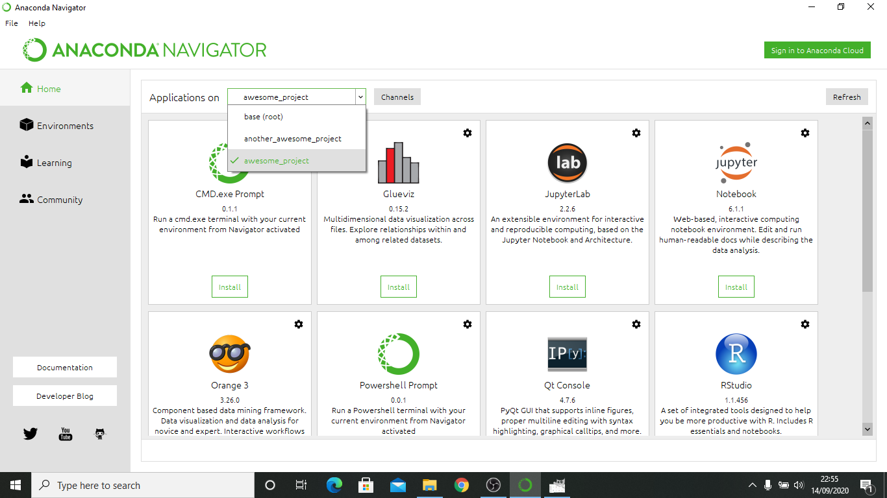
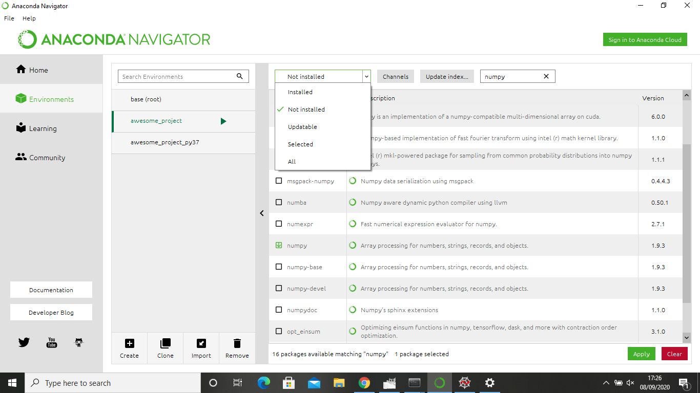

# Anaconda

[Anaconda](https://www.anaconda.com/products/individual)<sup>&#174;</sup> is a Python distribution
and package management system. It provides an installation of Python (at the time of writing in
September 2020 this defaults to [Python 3.8](https://docs.python.org/3/whatsnew/3.8.html)) and a way
to create "virtual environments" that can contain different Python version and software packages
required for a specific task.

## Installing Anaconda

The official instructions for installing Anaconda on a variety of operating systems can be found at
[https://docs.anaconda.com/anaconda/install/](https://docs.anaconda.com/anaconda/install/), but we
will also go through the steps below.

!!! note
    The full Anaconda installation will require just under 3 Gb of space on your computer.
    
    For users who are confident using a text-based @(terminal) there is a much lighter weight
    installation that can be used called [Miniconda](https://docs.conda.io/en/latest/miniconda.html),
    which does not provide many of the graphical user interface tools.

=== "Installation on Windows 10"    
    * Visit [https://www.anaconda.com/products/individual](https://www.anaconda.com/products/individual)
      and scroll down until you see the Download options:

    

    * Under the "Windows <i class="fa fa-windows"></i>" option click on "64-bit Graphical
      Installer" to download the installation executable.
    * Click on the downloaded executable to start the setup (often via an icon now located at the
      bottom of you browser window), which should provide a window with instructions to follow:

    

    * Click the ++"Next >"++ button to begin installation.
    * Click ++"I Agree"++ in the "License Agreement" window.
    * On the "Select Installation Type" window you can either select to install for "Just me" or
      "All users". If you are the only user of your machine then either option is fine. If there
      are multiple users (i.e., it's a shared machine) then "Just me" can be used.
    * On the "Choose Install Location" window, unless you have a preferred install location for
      software, leave the install location as the default option. In general, if installing on
      your own machine, this will be "`C:\Users\<username>\anaconda3`", where "`<username>`"
      will be replaced with your own user name on the machine.
    * On the "Advanced Installation Options" window leave the tick in the box next to "Register
      Anaconda3 as my default Python 3.8" and click the ++"Install"++ button.
    * Once installation is complete continue clicking though with the ++"Next >"++ buttons and finally
      click ++"Finish"++ (if you leave the check boxes on the final window ticked, then links to
      tutorials will open in your browser).

    Once installed, click on the Windows start button (the <i class="fa fa-windows"></i> in the
    bottom left of the screen), and the menu should now contain "Anaconda3 (64-bit)", which can
    be clicked on to reveal several installed programmes.

    

    Alternatively, type "Anaconda" into the search bar to see the installed programmes.

=== "Installation on Mac OS"
    * Visit [https://www.anaconda.com/products/individual](https://www.anaconda.com/products/individual)
      and scroll down until you see the Download options:

    

    * Under the "MacOS <i class="fa fa-apple"></i>" option click on "64-bit Graphical
      Installer" to download the installation executable.

=== "Installation on Linux"
    For Linux users we recommend just installing the lightweight
    [Miniconda](https://docs.conda.io/en/latest/miniconda.html) package rather than the
    full Anaconda installation. Instructions for installing Miniconda under Linux can be found
    [here](https://docs.conda.io/projects/continuumio-conda/en/latest/user-guide/install/linux.html),
    which we summarise below.

    The instructions below are those for installation via command line only.

    * Download the [latest Miniconda installation](https://docs.conda.io/en/latest/miniconda.html#linux-installers) file from
      [https://repo.anaconda.com/miniconda/Miniconda3-latest-Linux-x86_64.sh](https://repo.anaconda.com/miniconda/Miniconda3-latest-Linux-x86_64.sh
      ) either via your browser
      or from the command line with, e.g.,

      ```bash
      wget https://repo.anaconda.com/miniconda/Miniconda3-latest-Linux-x86_64.sh
      ```

    * In the directory that you downloaded `Miniconda3-latest-Linux-x86_64.sh` run:

      ```bash
      bash Miniconda3-latest-Linux-x86_64.sh
      ```

    * Follow the on screen instructions. Hold down ++enter++ to scroll through the license agreement and type `yes` to accept it.
    * Press ++enter++ to accept the default installation location, unless you have a specific location where you want it installed.
    * When asked if you wish the installer to "initialize Miniconda3 by running conda init" type `yes`.

    <asciinema-player src="minicondainstallation.cast" cols="82" rows="23" autoplay="true"></asciinema-player>
    
    To test if Miniconda is installed, open a new terminal and type:

    ```bash
    conda --version
    ```

    If correctly installed the conda version should be printed to screen. If you open a new
    terminal the @(command prompt) should now begin with `(base)`, which is the name of the default
    conda environment.

## Anaconda Navigator

If you have installed the full Anaconda package a programme called "_Anaconda Navigator_" will be
available to use. It allows you to launch a range of applications, create new environments
containing different Python packages, and install new packages.

=== "Windows 10"
    If you click on the Windows start button <i class="fa fa-windows"></i>, then click
    on "Anaconda3 (64-bit)" it will reveal a drop down menu containing "Anaconda Navigator
    (anaconda3)". Click on that button to open the Navigator:

    

    It will open within the "<i class="fa fa-home"></i> Home" tab and show a set of applications
    that can be launched. The most relevant of these for this course are:
    
     * Powershell Prompt: this opens a @(terminal) programme for running commands;
     * [VS Code](../demo-vs-code/index.html): a text editor that is useful for writing code.

    Above the table of applications the Navigator says "Applications on `base (root)`". Here `base`
    is the name of the default @(virtual environment) that Anaconda creates. This environment has
    various Python packages installed in it by default. This set of packages can be seen by
    clicking on the "Environments" tab:

    

    This will have a list of the environments, which after installation will only contain
    `base (root)` and then a list of installed packages (along with their version number).
    By scrolling down you should find that this list includes numpy, matplotlib, and scipy,
    which are useful for this course.

=== "Mac OS"
    In Finder type "Anaconda Navigator"...

### Creating a new environment

In this course every Python package you should need is installed within the Anaconda `base`
@(virtual environment). However, as good practice for future projects, it is useful to know how to
create new environment.

Instructions for creating a new environment using either _Anaconda Navigator_ or via the @(command
line) in a @(terminal) are given below:

=== "Anaconda Navigator"
    After opening _Anaconda Navigator_ (as described above) click on the
    "<i class="fa fa-cube"></i> Environments" tab on the left hand side of the screen. At the
    bottom of the middle panel click on the "Create" <i class="fa fa-plus-square"></i> button to
    open up a new dialogue box:

    

    Type the name for your project, e.g., `awesome_project`, select the "Python" tickbox and the
    Python version (defaulting to 3.8), and click ++"Create"++. Creating the environment will take
    a bit of time while Anaconda downloads and installs the required packages. It will then appear
    listed under the `base (root)` environment and the packages it contains will be shown.

=== "Terminal"
    A new environment can be create using a terminal (e.g., the Anaconda Powershell prompt in Windows
    or the default terminal programme on Mac OS or Linux). To start open the terminal (in Windows use
    the start menu or search bar to find "Anaconda Powershell Prompt", or launch it via the
    _Anaconda Navigator_).

    !!! warning
        On Windows the Anaconda installation is not available by default within the normal "Windows
        PowerShell", so make sure to use the "Anaconda" version.

    Create a new environment by typing:

    ```bash
    conda create -n awesome_project
    ```

    where you give the name of your environment by supplying it after the `-n` flag, which in this
    case is `awesome_project`. By default the environment will contain a Python 3.8 installation,
    but you can specify a different Python version using the `python` command, e.g.,:

    ```bash
    conda create -n awesome_project_py37 python=3.7
    ```

    <asciinema-player src="condacreate.cast" cols="82" rows="23" autoplay="true"></asciinema-player>

#### Using a new environment

Once a new environment has bee create you can then run code within it making use of the specific
Python version and packages installed within it.

=== "Anaconda Navigator"
    Within the _Anaconda Navigator_ "<i class="fa fa-home"></i> Home" tab you can switch between
    environment using the dropdown menu next to "Applications on":

    

    Not all of the applications shown will be installed in the new environment, so you may need to
    click on the ++"Install"++ button below the required application. However, VS Code should be
    installed by default.

    You can then launch the required application within the new environment by click on the
    associated ++"Launch"++ button, e.g., for the one below VS Code.

=== "Terminal"
    To switch between environments in a terminal you can use the `conda activate` command, e.g.,:

    ```bash
    conda activate awesome_project
    ```

    The @(command prompt) should now start with the name of the environment in brackets, e.g.,
    `(awesome_project)`. If you start a [Python terminal session](../demo-python-terminal/index.html)
    it will use the version of Python installed in that environment and have access to that
    environments packages.

    To move back out of a particular environment you can use:

    ```bash
    conda deactivate
    ```

#### Installing packages

Within an environment you can install Python any @(packages) that you require so long as they are
available either within the [Anaconda Cloud](https://anaconda.org/) or the @(PyPI) package
repositories.

=== "Anaconda Navigator"
    In _Anaconda Navigator_, click on the "<i class="fa fa-cube"></i> Environments" tab, and in the
    middle panel select the environment into which you want to install a package. Select the
    dropdown menu that says "Installed" and select "Not installed". Then search for the name of the
    package you want to install, e.g., [numpy](../demo-numpy/index.html), in the search bar.

    

    There may be multiple package that are found, but scroll to find the one with the exact name you
    were after and click in the checkbox next to it. Boxes saying ++"Apply"++ and ++"Clear"++ will
    appear in the bottom right of the window. Click on ++"Apply"++. A dialogue box will then appear
    showing then packages that will be installed. This will often show more than just the package
    that you selected as many packages depend on other packages and therefore require then also to
    be installed. Again click ++"Apply"++ to install the package(s).

    !!! note
        You can select multiple packages and install them all at once.

    Once installed, that package will be available to import when running Python within the
    associated environment.

=== "Terminal"
    To install packages using the terminal you can make use of either the `conda install`
    command, or the `pip install` command.

    First, activate the environment into which you want to install a package, e.g.,:

    ```bash
    conda activate awesome_project
    ```

    then, to install [numpy](../demo-numpy/index.html), for example, you could use:

    ```bash
    conda install numpy
    ```

    !!! note
        Many packages are available via either `conda install` or `pip install`. In general,
        installing packages using `conda install` takes a bit longer as it will also manage
        and install non-Python dependencies of a package.

        If you can, stick to using `conda install`. However, sometimes `pip install` is
        required if the package is only available via @(PyPI).

    If you want a particular version of a package then you can supply that information with, e.g.,

    ```bash
    conda install numpy==1.18.1
    ```
