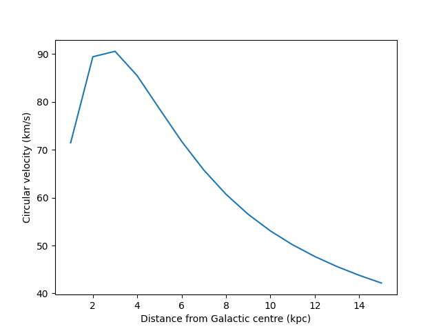

# Classes

<iframe width="560" height="315" src="https://www.youtube.com/embed/1SfbkcOipiA" frameborder="0" allow="accelerometer; autoplay; clipboard-write; encrypted-media; gyroscope; picture-in-picture" allowfullscreen></iframe>

Almost everything in Python is an [object](glossary.md#object). All objects (e.g., variables, functions) have a type.
An object's type is also known as its [**class**](https://docs.python.org/3/tutorial/classes.html).
A [class](glossary.md#class) can also be thought of as a template for creating an object of that type.

Objects can combine holding data with functionality. Anything that you can access in an object is
known as an [attribute](glossary.md#attribute). Attributes can either be [data attributes](glossary.md#data-attribute) (sometime also known as class
properties, class members or class variables) or [function attributes](glossary.md#function-attribute) (also known as @(class
methods)). In Python all of a class' attributes are public, i.e., you can access them from an
instance of a class.

To add to this, [data attributes](glossary.md#data-attribute) can be of two types:

1. [class attributes](glossary.md#class-attribute) - these belong to the class itself and are the same value for every instance
   of the class (and can even be used without creating a [class instance](glossary.md#class-instance)),
2. [instance attributes](glossary.md#instance-attribute) - these belong to a specific [class instance](glossary.md#class-instance) and may be different (based
   on user input) between instances.

A new class can be defined using the
[`class`](https://www.w3schools.com/python/ref_keyword_class.asp) keyword.

!!! note
    You _can_ write perfectly good codes in Python without ever having to define your own object's
    classes. However, using classes is part of the Object Oriented paradigm and in many cases it
    makes intuitive and practical sense to bundle certain bits of data and certain functions
    together, i.e., define a class.

## A simple class

A simple class containing just [class attributes](glossary.md#class-attribute) can be created using:

```python
class Electron:
    # indents are required to define thing within a class
    name = "electron"
    charge = -1.6e-19  # electric charge in coulombs
    mass = 9.1e-31  # mass in kg
```

Variables can then be created from this class (also known as [class instances](glossary.md#class-instance)) with:

```python
e = Electron()  # note the brackets are required
```

The [class attributes](glossary.md#class-attribute) of the object can be accessed using a `.` followed by their name, e.g.,:

```python
print(e.mass)
9.1e-31
```

!!! note
    Even though [class attributes](glossary.md#class-attribute) are public (i.e., viewable and changeable by the user), it is
    not good practice to change them in any [class instance](glossary.md#class-instance). If you want
    to set [data attributes](glossary.md#data-attribute) that can be altered you should use [instance attributes](glossary.md#instance-attribute) that are set
    when initialising the class, or through a class method, or
    using [properties](https://www.python-course.eu/python3_properties.php) (setters are not covered
    in this course).

[Class attributes](glossary.md#Class-attribute) can also be accessed directly from the class rather than an instance, e.g.,

```python
print(Electron.mass)
9.1e-31
```

## A class with initialisation

The above class has been created with a fixed set of values using [class attributes](glossary.md#class-attribute). Every time an
instance of the class is created the attributes will be the same.

It is often useful to be able to create an instance of a class with user defined values rather than
fixed values. Python classes can have a special method called `__init__` that defines how the class
is initialised and can take in user supplied arguments. In OOP languages like `C++` the `__init__`
method is equivalent to what is called a
[constructor](https://en.wikipedia.org/wiki/Constructor_(object-oriented_programming)).

```python
class Particle:
    def __init__(self, name, charge, mass):
        # the initialisation function
        self.name = name
        self.charge = charge
        self.mass = mass
```

Now, `Particle` class instances can be created for different particles by supplying their values,
e.g.,:

```python
electron = Particle("electron", -1.6e-19, 9.1e-31)
proton = Particle("proton", 1.6e-19, 1.7e-27)

for p in [electron, proton]:
    print(f"{p.name} mass = {p.mass}")
electron mass = 9.1e-31
proton mass = 1.7e-27
```

The `__init__` method of a class can have [positional arguments](glossary.md#positional-argument) and/or [keyword arguments](glossary.md#keyword-argument),
just like any other function. Using keyword arguments allows the setting of default initialisation
values if no user supplied values are given, e.g.,

```python
class Particle:
    def __init__(self, name="electron", charge=-1.6e-19, mass=9.1e-31):
        # if no values are supplied the default values will be used
        self.name = name
        self.charge = charge
        self.mass = mass

myparticle = Particle()
print(myparticle.name)
electron
```

### `self`

The `__init__` method, and any other regular methods defined in a class, takes `self` as its first
argument. But when creating the new object above nothing was passed for `self`, i.e., the brackets
were empty! When **defining** a class method the method has to have the class instance explicitly
passed to it. This allows that method to access all the attributes of the current class instance via
`self`. But, when using a method `self` is passed implicitly, i.e., the user does not have to supply
it as it is supplied automatically.

!!! note
    The usage of the word "`self`" is just convention. In reality any word can be used in place
    of `self` as long as it is consistently used throughout the class, e.g.,

    ```python
    class whatsit:
        def __init__(cheesy, name="Blah"):  # using cheesy instead of self!
            cheesy.name = name

        def show_name(cheesy):
            print(f"My name is {cheesy.name}")
    ```

    It is recommended to stick to using `self`!

### Adding methods

Methods are defined just like standard functions, but within the class definition. The first
argument that they take must be `self`, so that all other class attributes are available within it.

```python
class Particle:
    def __init__(self, name, charge, mass, spin=None):
        # the initialisation function
        self.name = name
        self.charge = charge
        self.mass = mass
        self.spin = spin

    def fermion_or_boson(self):
        """
        Determine if the particle is a fermion or a boson.
        """

        # note: the method is able to use the instance's "spin" attribute via self
        if self.spin is not None:
            if self.spin % 0.5 == 0.0:
                return "fermion"
            elif self.spin % 1.0 == 0.0:
                return "boson"
            else:
                print("Particle is neither a fermion or a boson")
                return None
        else:
            return None
```

Like the data attributes, this method can then be accessed using a `.` followed by the method name,
e.g.,:

```python
electron = Particle("electron", -1.6e-19, 9.1e-31, spin=1/2)
print(electron.fermion_or_boson())  # note the brackets when accessing the method
fermion
```

The `fermion_or_boson` method does not take in any arguments (other than the implicit `self`). A
method that could be added to the particle is one that calculates the [Lorentz
force](https://en.wikipedia.org/wiki/Lorentz_force) on the particle in an electric and magnetic
field:

```python
class Particle:
    def __init__(self, name, charge, mass, spin=None):
        # the initialisation function
        self.name = name
        self.charge = charge
        self.mass = mass
        self.spin = spin

    def fermion_or_boson(self):
        """
        Determine if the particle is a fermion or a boson.
        """

        if self.spin is not None:
            if self.spin % 0.5 == 0.0:
                return "fermion"
            elif self.spin % 1.0 == 0.0:
                return "boson"
            else:
                print("Particle is neither a fermion or a boson")
                return None
        else:
            return None

    def lorentz_force(self, E, B=[0.0, 0.0, 0.0], v=[0.0, 0.0, 0.0]):
        """
        Calculate the Lorentz force on the particle.

        Parameters
        ----------
        E: array
            A vector giving the x, y and z components of the electric field
            (required).
        B: array
            A vector giving the x, y and z components of the magnetic field
            (defaults to zero).
        v: array
            A vector giving the x, y and z components of the particle's
            velocity (defaults to zero)

        Returns
        -------
        F: list
            The 3d Lorentz force vector.
        """

        if len(E) != 3:
            # check E is the right length
            raise ValueError("E is not the right length")

        F = 3 * [0.0]  # initialise F as list of 3 zeros
        
        # calculate F = q * (E + v x B)
        F[0] = self.charge * (E[0] + v[1] * B[2] - v[2] * B[1])
        F[1] = self.charge * (E[1] + v[2] * B[0] - v[0] * B[2])
        F[2] = self.charge * (E[2] + v[0] * B[1] - v[1] * B[0])

        return F


electron = Particle("electron", -1.6e-19, 9.1e-31)
```

First, we can see what happens if we used the method incorrectly (error checking is discussed in
more detail in the ["Error checking and debugging" tutorial](demo-error-checking.md)).
The `lorentz_force` method requires one positional argument, but if we do not supply one then:

```python
# calculate the Lorentz force (forgetting the required positional argument!)
F = electron.lorentz_force()
---------------------------------------------------------------------------
TypeError                                 Traceback (most recent call last)
<ipython-input-23-14143ee08c6d> in <module>
----> 1 F = electron.lorentz_force()

TypeError: lorentz_force() missing 1 required positional argument: 'E'
```

The positional argument must be a list containing three values, but if we try and use two, then:

```python
# try again (with E being the wrong length!)
F = electron.lorentz_force([0.1, 0.2])
---------------------------------------------------------------------------
ValueError                                Traceback (most recent call last)
<ipython-input-24-966d81233b8b> in <module>
----> 1 F = electron.lorentz_force([0.1, 0.2])

<ipython-input-20-98635895214d> in lorentz_force(self, E, B, v)
     42         if len(E) != 3:
     43             # check E is the right length
---> 44             raise ValueError("E is not the right length")
     45
     46         F = 3 * [0.0]  # initialise F as zeros

ValueError: E is not the right length
```

Finally, we will use it correctly:

```python
# try again!
F = electron.lorentz_force([0.1, 0.2, 0.3])
print(F)
[-1.6e-20, -3.2e-20, -4.8e-20]
```

The `lorentz_force` method above takes one positional argument and two keyword arguments (that give
default values). Any number of positional or keyword arguments could be used.

The `lorentz_force` method could be simplified using NumPy (see the [NumPy
tutorial](demo-numpy.md).

### Special methods

There are a set of [special method names](https://rszalski.github.io/magicmethods/) (sometimes
called "dunder" methods as they start and end with a double underscore, but also known as magic
methods) like `__init__` that can be defined in a class. These can be used:

 * to allow comparisons of objects of specific class;
 * define how mathematical operators work on a class (see [Operator overloading](#operator-overloading));
 * access attributes within a class;
 * provide representations of class.

The full set of special methods can be found
[here](https://docs.python.org/3/reference/datamodel.html#special-method-names).

One particular special method that we will use in this course is
[`__str__`](https://thomas-cokelaer.info/blog/2017/12/difference-between-__repr__-and-__str__-in-python/).
This defines how to display a class instance as a string, for example, if trying to print the
object:

```python
class Particle:
    def __init__(self, name="electron", charge=-1.6e-19, mass=9.1e-31):
        # if no values are supplied the default values will be used
        self.name = name
        self.charge = charge
        self.mass = mass

    def __str__(self):
        # a string representing the object
        vowel = self.name[0].lower() in ["a", "e", "i", "o", "u"]
        firstword = "An" if vowel else "A"  # shorthand if else statement!

        return f"{firstword} {self.name} with mass of {self.mass} kg and charge of {self.charge} C"

myparticle = Particle(name="positron", charge=1.6e-19)
print(myparticle)
A positron with mass of 9.1e-31 kg and charge of 1.6e-19 C
```

A similar method that can be used instead is `__repr__`.

## Static methods

Static methods are functions within a class that can be used without creating a new instance of that
class. As they do not use an instance of the class they do not have access to any of the other class
attributes, i.e., they are standalone and must be supplied with all the variables they require.

Unlike normal methods they do not get passed the `self` argument. To make a method static you use
the [`@staticmethod`](https://docs.python.org/3/library/functions.html#staticmethod)
[decorator](glossary.md#decorator) on the line above the method definition, e.g.,:

```python
class Line2D:
    """
    A class defining a line in 2d coordinates.

    Parameters
    ----------
    point1: tuple
        A tuple containing the (x, y) coordinates of one end of the line.
    point2: tuple
        A tuple containing the (x, y) coordinates of the other end of the line.
    """

    def __init__(self, point1, point2):
        self.point1 = point1
        self.point2 = point2

        # set the gradient and y-intercept of the line using the static method
        m, c = Line2D.coefficients(self.point1, self.point2)
        self.grad = m
        self.yintercept = c

    @staticmethod
    def coefficients(point1, point2):
        """
        Get the coefficients of the linear equation:
        
        y = C_1 x + C_0

        defined by the two points, where C_1 defines the gradient and C_0 defines
        the y-intercept.
        """

        # Note that self is not passed to the method.

        # check lengths
        if len(point1) != 2 or len(point2) != 2:
            raise ValueError("Points on the line must be 2D")

        # get differences
        dx = point2[0] - point1[0]
        dy = point2[1] - point1[1]
        C1 = dy / dx

        C0 = point2[1] - C1 * point2[0]

        return C1, C0
```

To get the linear equation coefficients we could then do:

```python
point1 = (8, 10)
point2 = (10, 12)
# use staticmethod without creating an instance of Line2D
m, c = Line2D.coefficients(point1, point2)
print(f"Gradient is {m}, y-intercept is {c}")
Gradient is 1.0, y-intercept is 2.0
```

The static method can also be used by an instance of the class, e.g.,

```python
point1 = (-9, 10)
point2 = (-2, 5)

# create a line
line = Line2D(point1, point2)
print(line.grad, line.yintercept)
-0.7142857142857143 3.571428571428571

# work out gradient and y-intercept of a new line
mnew, cnew = line.coefficients((1, 2), (2, 3))
print(mnew, cnew)
1.0 1.0

# because it's a static method it hasn't altered anything in "line"
print(line.point1, line.point2)
print(line.grad, line.yintercept)
(-9, 10) (-2, 5)
-0.7142857142857143 3.571428571428571
```

## Class inheritance

You may want to define a new class that is very similar to an already existing class, but adds new
attributes. Rather than redefining all of the aspects of the existing class in the new class you can
[inherit](https://www.w3schools.com/python/python_inheritance.asp) them from the existing class.

Suppose we have a `Galaxy` class:

```python
class Galaxy:
    """
    A class defining a galaxy.

    Parameters
    ----------
    mass: float
        The galaxy mass (in solar masses)
    distance: float
        The distance (in Mpc)
    type: str
        The type of galaxy, e.g., "spiral"
    name: str
        The galaxy's name. Defaults to None.
    """

    def __init__(self, mass, distance, type, name=None):
        self.mass = mass
        self.distance = distance
        self.type = type
        self.name = name

    def redshift(self, H0=70.0):
        """
        Calculate the redshift using Hubble's law.

        Parameters
        ----------
        H0: float
            Hubble's constant (defaults to 70 km/s/Mpc)
        """

        # recession velocity
        v = H0 * self.distance

        return v / 3e5  # velocity / speed of light (km/s)
```

Now, suppose we want a class specifically for a spiral galaxy, but that keeps the attributes of a
`Galaxy`, i.e., `Galaxy` is the [parent](glossary.md#parent) class (or superclass) and `SpiralGalaxy` will be its
[child](glossary.md#child) (or subclass). We can create a new class with:

```python
class SpiralGalaxy(Galaxy):  # this is where the Galaxy gets inherited
    """
    A class defining a spiral galaxy.
    """

    def __init__(self, bulge_mass, disc_mass, halo_mass, distance, name=None, barred=False):
        # the special "super" function allows initialisation of the common
        # Galaxy attributes
        super().__init__(bulge_mass + halo_mass + disc_mass, distance, "spiral", name=name)

        # add spiral specific properties
        self.bulge_mass = bulge_mass
        self.disc_mass = disc_mass
        self.halo_mass = halo_mass
        self.barred = barred  # has it got a bar

    def disc_circular_velocity(self, Rd, r):
        """"
        Calculate the contribution to the circular velocity of the disc (see Eqn. 1
        of astro-ph/9909252).

        Parameters
        ----------
        Rd: float
            The disc scale-length (kpc)
        r: array_like
            A set of positive radial values at which to calculate the velocity (kpc)

        Returns
        -------
        velocity: array_like
            A set of circular velocity values (km/s).
        """

        # import modified Bessel functions from scipy
        from scipy.special import iv, kn
        from math import sqrt 

        disc_mass_si = self.disc_mass * 1.99e30  # disc mass in kg

        velocities = []  # list to hold velocities

        for rval in r:
            x = rval / Rd
            B = iv(0, x / 2) * kn(0, x / 2) - iv(1, x / 2) * kn(1, x / 2)
            G = 6.67e-11  # Newton's gravitational constant
            v = sqrt(0.5 * G * (disc_mass_si / (Rd * 3.086e19)) * x ** 2 * B)
            velocities.append(v / 1e3)  # convert to km/s

        return velocities
```

If we create a `SpiralGalaxy`:

```python
bulge_mass = 3.0e8  # solar masses
disc_mass = 6.0e9
halo_mass = 5.0e10
distance = 0.84  # Mpc
m33 = SpiralGalaxy(bulge_mass, disc_mass, halo_mass, distance, name="M33")
```

we can then use attributes from the `Galaxy` class like:

```python
z = m33.redshift()
print(f"{m33.name}'s redshift is {z}")
M33's redshift is 0.000196
```

or use the new attributes:

```python
rs = list(range(1, 16))  # range of distances
Rd = 1.2  # disk scale in kpc
vs = m33.disc_circular_velocity(Rd, rs)

from matplotlib import pyplot as plt
plt.plot(rs, vs)
plt.xlabel("Distance from Galactic centre (kpc)")
plt.ylabel("Circular velocity (km/s)")
plt.show()
```



!!! note
    Just for correctness, I should note that M33's actual observed redshift is not 0.000196! That's
    what its cosmological redshift would be, but it's in our local group of galaxies and so is
    subject to local gravitational accelerations. Therefore its redshift is dominated by that
    local motion with respect to the Milky Way.


## Operator overloading

Mathematical operators (e.g., `+`, `-`, `*`, `/`) can be applied to number classes like `int`s or
`float`s. But, if it's sensible to do so, you can define how the mathematical operators act on any
class you define.

If you want to be able to define a way to, for example, add two instances of a particular object you
can used the special [`__add__`](https://docs.python.org/3/reference/datamodel.html#object.__add__)
method. The are equivalent methods for the other mathematical
[operators](https://docs.python.org/3/reference/datamodel.html#emulating-numeric-types) and logical
expressions.

Suppose you had a class representing a vector in 3D Cartesian coordinates:

```python
class Vector:
    """
    A class representing a vector in 3D Cartesian coordinates.

    Parameters
    ----------
    x: int, float
        The component of the vector in the x-dimension
    y: int, float
        The component of the vector in the y-dimension
    z: int, float
        The component of the vector in the z-dimension
    """

    def __init__(self, x, y, z):
        self.vector = []  # store vector as a list
        for v in [x, y, z]:
            # test that we've given the class numbers
            if not isinstance(v, (int, float)):
                raise ValueError("Vector can only contain numbers")

            self.vector.append(v)

    @property
    def x(self):
        return self.vector[0]

    @property
    def y(self):
        return self.vector[1]

    @property
    def z(self):
        return self.vector[2]

    def norm(self):
        """
        Return the length of the vector.
        """
        from math import sqrt
        return sqrt(sum([v ** 2 for v in self.vector]))

    def unit(self):
        """
        Return the unit vector.
        """

        norm = self.norm()
        return [v / norm for v in self.vector]

    def __len__(self):
        # the length of the vector (__len__ is another magic method for
        # returning the "length" of a class, if applicable)
        return len(self.vector)
```

!!! note
    In the above definition it has used the `@property` function [decorator](glossary.md#decorator). This is a way to
    define methods in a class that can allow aspects of a current data attributes to be accessed
    with a different name. Here it is handy to store the vector as a list-type data attribute,
    but it is also nice to be able to access the individual components in an intuitively named
    manner. Hence defining properties for `x`, `y` and `z` that only return those components.
    These attributes can be accessed with, e.g.,:

    ```python
    v1 = Vector(1, 2, 3)
    print(v1.x)  # despite being defined as a function the x property can be access without using () 
    1
    ```

It would be useful to be able to add two of these vectors together and return a new vector. But,
trying this leads to:

```python
v1 = Vector(1, 2, 3)
v2 = Vector(4, 5, 6)
v3 = v1 + v2  # try adding the vector
---------------------------------------------------------------------------
TypeError                                 Traceback (most recent call last)
<ipython-input-7-13b475227a38> in <module>
----> 1 v3 = v1 + v2

TypeError: unsupported operand type(s) for +: 'Vector' and 'Vector'
```

However, the `__add__` special method can be used to define how to do standard vector addition
(i.e., adding each component separately), e.g.,:

```python
class Vector:
    """
    A class representing a vector in 3D Cartesian coordinates.

    Parameters
    ----------
    x: int, float
        The component of the vector in the x-dimension
    y: int, float
        The component of the vector in the y-dimension
    z: int, float
        The component of the vector in the z-dimension
    """

    def __init__(self, x, y, z):
        self.vector = []  # store vector as a list
        for v in [x, y, z]:
            # test that we've given the class numbers
            if not isinstance(v, (int, float)):
                raise ValueError("Vector can only contain numbers")

            self.vector.append(v)

    @property
    def x(self):
        return self.vector[0]

    @property
    def y(self):
        return self.vector[1]

    @property
    def z(self):
        return self.vector[2]

    def norm(self):
        """
        Return the length of the vector.
        """
        from math import sqrt

        return math.sqrt(sum([v ** 2 for v in self.vector]))

    def unit(self):
        """
        Return the unit vector.
        """

        norm = self.norm()
        return [v / norm for v in self.vector]

    def __len__(self):
        # the length of the vector
        return len(self.vector)

    def __add__(self, other):
        # use the argument "other" to represent the other vector to be added

        # check that other is actually also a vector
        if not isinstance(other, Vector):
            raise TypeError("Can only add two Vectors")

        # return a new Vector object
        return Vector(self.x + other.x, self.y + other.y, self.z + other.z)
```

then we could do:

```
v1 = Vector(1, 2, 3)
v2 = Vector(4, 5, 6)
v3 = v1 + v2
print(v3.vector)
[5, 7, 9]
```

!!! note
    In reality, for something like a vector, the [NumPy](demo-numpy.md) library already
    has useful classes called arrays for which the mathematical operators are all defined.

If you wanted to use the `+=` operator, e.g., to change v1 in-place

```python
v1 += v2
```

you would also have to define the
[`__iadd__`](https://docs.python.org/3/reference/datamodel.html#object.__iadd__) function.

Logical operators and comparison operation can also be overloaded.