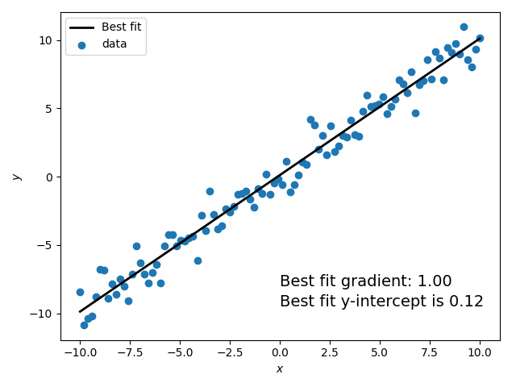
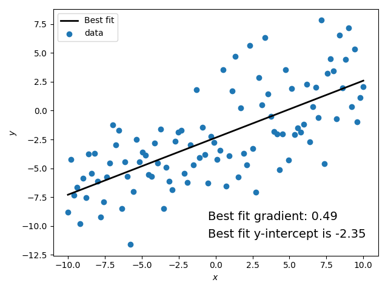

# Fitting a line

There are many analyses where you might want to try and fit a function to some data. There are also
many ways that you can do this in Python. Here we will give a very brief demonstration of fitting a
simple polynomial function, e.g., a line, to data using methods that make use of standard [least
squares fitting](https://en.wikipedia.org/wiki/Least_squares).

## Least squares fitting

We will briefly describe least squares fitting for a simple linear equation (often known as [linear
regression](https://en.wikipedia.org/wiki/Linear_regression)). Suppose we have a set of data points
$\mathbf{y} = \{y_1, y_2, \ldots, y_n\}$ evaluated, or measured, at points $\mathbf{x} = \{x_1, x_2,
\ldots, x_n\}$ and a model that describes a line $\mathbf{m} = \beta_0 + \beta_1 \mathbf{x}$. To fit
the model to the data we are interested in finding the values of $\vec{\beta} = \{\beta_0,
\beta_1\}$ that "best" match the data. There are multiple equivalent ways of framing this
(minimising the mean square loss function, minimising the $\chi^2$ or maximising the likelihood),
but they all basically break down to the same thing; finding the values of $\vec{\beta}$ that solve
the pair of equations:

$$
\frac{\partial L}{\partial\beta_0} = 0 \text{ and } \frac{\partial L}{\partial\beta_1} = 0,
$$

where

$$
L = \sum_i^n \left(y_i - m_i\right)^2 \equiv \sum_i^n \left(y_i - \beta_0 - \beta_1 x_i\right)^2. 
$$

Performing the differentiation and doing a bit of algebra produces the solutions:

$$
\hat{\beta}_0 = \frac{\sum y_i \sum x_i^2 - \sum y_i x_i \sum x_i}{n\sum x_i^2 - \left(\sum x_i \right)^2},
$$

and

$$
\hat{\beta}_1 = \frac{n\sum y_i x_i - \sum y_i \sum x_i}{n\sum x_i^2 - \left(\sum x_i \right)^2}.
$$

This can be generalised to polynomials of any order and can also include weighting for each data
point, i.e., in cases where the noise on measurements is not the same for each measurement.

## Fitting a line with NumPy

In the [NumPy](../demo-numpy/index.html) library there is more than one function for doing least
squares fitting:

* [`polyfit()`](https://numpy.org/doc/stable/reference/generated/numpy.polyfit.html) - fit a
  polynomial of given order to some data
* [`lstsq()`](https://numpy.org/doc/stable/reference/generated/numpy.linalg.lstsq.html#numpy.linalg.lstsq) - in the `linalg` submodule.

We will show an example with using `polyfit()` for a polynomial of order 1, i.e., a straight line.
To do this we will generate some fake data consisting of a line with added noise (which in reality
might come from uncertainties on the measurements).

```python
import numpy as np
from matplotlib import pyplot as plt


# define our linear model function
def model(x, beta0, beta1):
    """
    A function describing a straight line.

    Parameters
    ----------
    x: array_like
        A set a values at which to evaluate the model
    beta0: float
        The coefficients of the linear model providing the y-intercept
    beta1: float
        The coefficients of the linear model providing the gradient

    Returns
    -------
    y: array_like
        An array containing the model evaluated at the x values
    """

    return beta0 + x * beta1


# create our "fake" data
n = 100  # number of data points
x = np.linspace(-10, 10, n)  # set x values at which the measurements are made
noise = np.random.default_rng().normal(0.0, 1.0, n)  # set Gaussian noise with mean of 0 and standard deviation of 1
beta = [0.0, 1.0]  # set "true" y-intercept and gradient to be 0 and 1

data = model(x, beta[0], beta[1]) + noise

# perform line fitting with polyfit
order = 1  # polynomial of order 1, i.e., a straight line
c = np.polyfit(x, data, order)

# plot the data and the best fit line
fig, ax = plt.subplots()
ax.scatter(x, data, label="data")  # plot the data
ax.plot(x, model(x, c[1], c[0]), 'k', lw=2, label="Best fit")  # plot the "best fit" line
ax.set_xlabel("$x$")
ax.set_ylabel("$y$")
ax.text(0, -8, 'Best fit gradient: {0:.2f}'.format(c[0]), fontsize=14)
ax.text(0, -9.5, 'Best fit y-intercept is {0:.2f}'.format(c[1]), fontsize=14)
ax.legend()

fig.tight_layout()
plt.show()
```



!!! note
    The output of `polyfit()`, given by `c` in the example above contains the coefficients ordered
    with that from the largest polynomial order first and the smallest order last, i.e., for the
    straight line fitting `c[0]` is the gradient (the coefficient of the $x^1$ term) and `c[1]` is
    the y-intercept (the coefficient of the $x^0$ term).

## Fitting a line with SciPy

In the [SciPy](https://docs.scipy.org/doc/scipy/reference/) library there are again multiple
function to do least squares fitting:

* [`curve_fit()`](https://docs.scipy.org/doc/scipy/reference/generated/scipy.optimize.curve_fit.html) - will fit any user supplied function, not just polynomials
* [`lsq_linear()`](https://docs.scipy.org/doc/scipy/reference/generated/scipy.optimize.lsq_linear.html) - solves the linear least squares problem
* [`least_squares()`](https://docs.scipy.org/doc/scipy/reference/generated/scipy.optimize.least_squares.html) - solves the non-linear least squares problem.

We will show an example of using `curve_fit()`. This can fit the parameters of an arbitrary user-defined
function, although we will again show fitting a straight line. `curve_fit()` requires the
function being fit to have its first argument as the independent variable, i.e., the $\mathbf{x}$
values in our example, follow by separate arguments for the parameters being fit. In the example, we
will again fit a straight line to some fake data and will re-use the `model` function from the
previous example:

```python
from scipy.optimize import curve_fit
from matplotlib import pyplot as plt


# create our "fake" data
n = 100  # number of data points
x = np.linspace(-10, 10, n)  # set x values at which the measurements are made
noise = np.random.default_rng().normal(0.0, 3.0, n)  # set Gaussian noise with mean of 0 and standard deviation of 3
beta = [-2.0, 0.5]  # set "true" y-intercept and gradient to be 0 and 1

data = model(x, beta[0], beta[1]) + noise

# perform line fitting with curve_fit
copt, ccov = curve_fit(model, x, data)

# plot the data and the best fit line
fig, ax = plt.subplots()
ax.scatter(x, data, label="data")  # plot the data
ax.plot(x, model(x, copt[0], copt[1]), 'k', lw=2, label="Best fit")  # plot the "best fit" line
ax.set_xlabel("$x$")
ax.set_ylabel("$y$")
ax.text(-0.5, -9.5, 'Best fit gradient: {0:.2f}'.format(copt[1]), fontsize=14)
ax.text(-0.5, -11, 'Best fit y-intercept is {0:.2f}'.format(copt[0]), fontsize=14)
ax.legend()

fig.tight_layout()
plt.show()
```



!!! note
    The output of `curve_fit()`, given by `copt` in the example above contains estimates of the
    parameters in the same order in which they are defined in the function being fit.