# Basic plotting with Matplotlib

<iframe width="560" height="315" src="https://www.youtube.com/embed/YHKTLzrKtKE" frameborder="0" allow="accelerometer; autoplay; clipboard-write; encrypted-media; gyroscope; picture-in-picture" allowfullscreen></iframe>

[Matplotlib](https://matplotlib.org/) is a powerful library for making plots in Python. It can be
used to create basic plots, but also has the ability to create very complex plots. A variety of
useful tutorials can be found on the [Matplotlib
webpage](https://matplotlib.org/stable/tutorials/index.html), but here we will cover some of the
basics.

The plotting functions within Matplotlib are found within the
[`pyplot`](https://matplotlib.org/stable/api/_as_gen/matplotlib.pyplot.html?highlight=pyplot#module-matplotlib.pyplot)
submodule, which is often imported using the @(alias):

```python
from matplotlib import pyplot as plt
```

Here we will assume `pyplot` has been imported in this way. We will also be using
[NumPy](../demo-numpy/index.html) arrays to hold the data being plotted, although lists can also be
used.

## Basic line plot

A basic line plot can be produced using the
[`plot`](https://matplotlib.org/stable/api/_as_gen/matplotlib.pyplot.plot.html#matplotlib.pyplot.plot)
function of `pyplot`. At its most basic `plot` takes a set of y-axis values:

```python
from matplotlib import pyplot as plt
import numpy as np

# create a quadratic curve
data = np.arange(0, 10) ** 2
plt.plot(data)

# plt.show() will open the plot in its own window
plt.show()
```

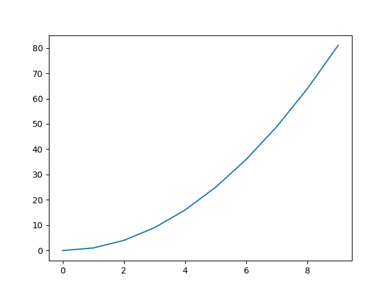

!!! note
    The [`show`](https://matplotlib.org/api/_as_gen/matplotlib.pyplot.show.html) function opens an
    interactive window showing the figure. This window allows you to zoom in on the figure and save
    the figure. By default, if using `show` the code, or terminal, will not continue until you
    close the figure window.

As seen above, the x-axis will just use the integer index values starting at 0.

You can control the x-axis values to use by passing them as the first argument to `plot`, e.g.,:

```python
x = np.linspace(-10, 10, 100)
y = 3.5 - 2.3 * x + 0.5 * x ** 2  # a more complex quadratic

# plot the data
plt.plot(x, y)
plt.show()
```

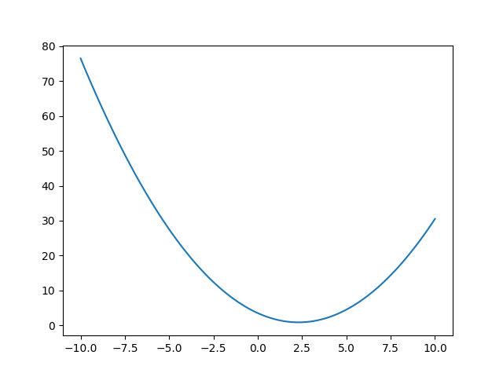

### Line styles and colours

The above plots default to a solid line in a blue colour. However, both the line style and colour
can be controlled. You can also control whether to show markers at each of the data points.

The line style can be set with the `linestyle` keyword argument (a shorthand of `ls` can also be
used), with the following values:

 * `"-"` or `"solid"` (this is the default)
 * `"--"` or `"dashed"`
 * `"-."` or `"dashdot"`
 * `":"` or `"dotted"`
 * `"None"`, `" "` or `""` for no line

```python
# show the different line styles
linestyles = ["-", "--", "-.", ":"]

x = np.linspace(-10, 10, 100)
for i, ls in enumerate(linestyles):
    y = 3.5 - 2.3 * (x + i) + 0.5 * (x + i) ** 2
    plt.plot(x, y, linestyle=ls, label=ls)

plt.legend()
plt.show()
```

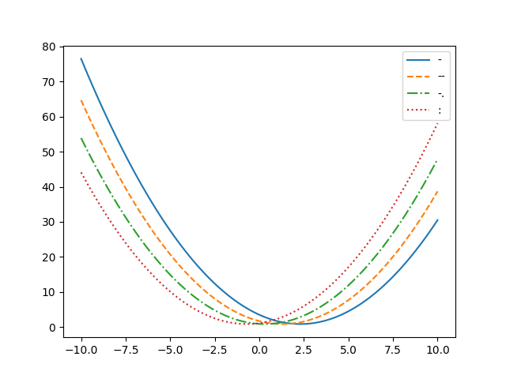

The above example has also shown how to plot multiple data sets on top of each other. It just
requires running the `plot` command multiple times. The different lines will default to use
different colours.

The line colour can be set using the `color` keyword argument (note the US spelling). There are a
wide range of [named colours](https://matplotlib.org/3.1.0/gallery/color/named_colors.html) that can
be used, although there are a set of base colours for which only the first initial is required:

```python
import matplotlib.colors as mcolors

print(list(mcolors.BASE_COLORS))
['b', 'g', 'r', 'c', 'm', 'y', 'k', 'w']
```

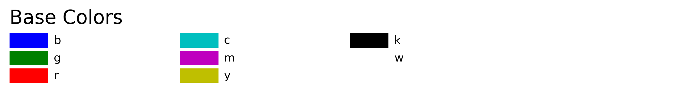

An example using a few of these colours is:

```python
colors = ["r", "g", "b", "k"]

x = np.linspace(-10, 10, 100)
for i, c in enumerate(colors):
    y = 3.5 - 2.3 * (x + i) + 0.5 * (x + i) ** 2
    plt.plot(x, y, color=c)

plt.show()
```

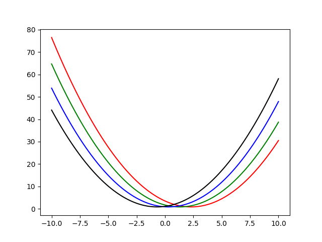

!!! note
    There are colourblind friendly colour palettes available, for example within the
    [`seaborn`](https://seaborn.pydata.org/tutorial/color_palettes.html#qualitative-color-palettes)
    package, e.g.,:
    
    ```python
    from matplotlib import pyplot as plt
    import seaborn

    # create 6 colours from the colorblind palette
    cp = seaborn.color_palette('colorblind', 6)

    # these colours will be given names "C0" through to "C5"
    for i in range(6):
        c = "C{}".format(i)  # set colour name
        plt.axvline(i, color=c, label=c)  # create vertical lines to show off colours
    plt.xlim([-1, 6])
    plt.legend(loc="upper right")
    plt.show()
    ```
    
    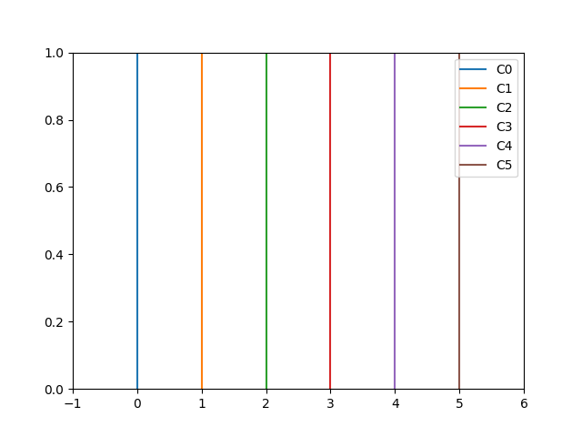

    Seaborn is provided within the `base` Anaconda environment.

#### Marker styles

In the above example just the line has been plotted, but markers can also be added for each data
point. The marker style can be set with the `marker` keyword argument. The full range of marker
styles are listed on the [marker page](https://matplotlib.org/api/markers_api.html), but here we
will list a few:

 * `"."` - a point
 * `"o"` - a circle
 * `"v"` - a downwards pointing triangle
 * `"*"` - a star
 * `"+"` - a plus
 * `"x"` - a cross
 * `"s"` - a square

The marker size can be set with the `markersize` keyword argument, and whether the marker is filled
or not can be set using the `markerfacecolor` keyword argument:

```python
markers = ["o", "v", "*", "s"]
markersizes = [4, 6, 8, 10]
markerfacecolors = ["None", "b", "r", "g"]
colors = ["k", "b", "r", "g"]
linestyles = ["-", "None", "-", "None"]  # set to show lines for alternate cases

x = np.linspace(-10, 10, 25)
for i in range(len(markers)):
    y = 3.5 - 2.3 * (x + 2 * i) + 0.5 * (x + 2 * i) ** 2
    plt.plot(
        x,
        y,
        marker=markers[i],
        markersize=markersizes[i],
        markerfacecolor=markerfacecolors[i],
        color=colors[i],
        linestyle=linestyles[i]
    )

plt.show()
```

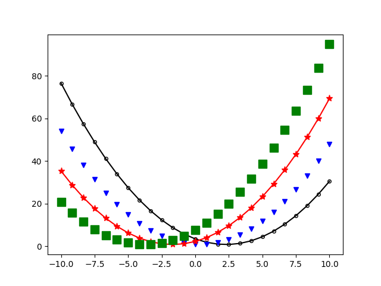

### Axis labels

The above plots were missing important information. Plots should always have axis labels!

Labels can be added to the x- and y-axes using the
[`xlabel`](https://matplotlib.org/stable/api/_as_gen/matplotlib.pyplot.xlabel.html#matplotlib.pyplot.xlabel)
and
[`ylabel`](https://matplotlib.org/stable/api/_as_gen/matplotlib.pyplot.ylabel.html#matplotlib.pyplot.ylabel)
functions, e.g.,:

```python
# some example data
position = [1.2, 5.6, 9.8, 17.9, 21.3, 24.3]
height = [4.5, 7.8, 10.3, 14.5, 12.2, 11.1]

plt.plot(position, height)
plt.xlabel("Position (m)")
plt.ylabel("Height (m)")
plt.show()
```

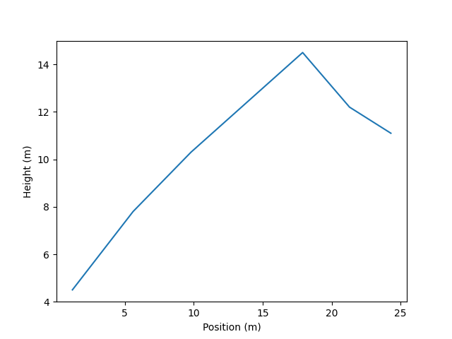

The font and font size for the axes labels, and many other [font
effects](https://matplotlib.org/stable/api/text_api.html#matplotlib.text.Text), can be controlled
with the `fontfamily` and `fontsize` keyword arguments, e.g.,

```python
plt.plot(position, height)
plt.xlabel("Position (m)", fontfamily="Monospace", fontsize=14)
# use a different font size for y-axis as an example
plt.ylabel("Height (m)", fontfamily="Times New Roman", fontsize=20)
plt.show()
```

For some reason the default font size in almost all plotting programs
and packages (including matplotlib) is far too small.  When creating
figures to include in a report or other document, you should always
make sure that the text and axis labels, etc., are a similar size to
the text in the main body of your report.  It shouldn't be necessary
to use a magnifying glass to read the axis labels!

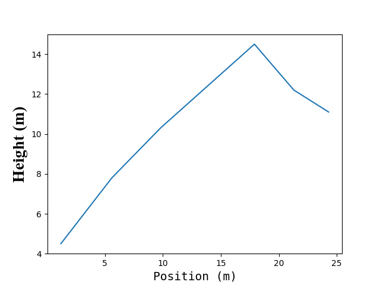

If you want to use mathematical text, or Greek lettering, in axes labels you can used LaTeX-like
commands enclosed in dollar signs, e.g.,

```python
x = np.linspace(-10, 10, 100)
y = x ** 2  # a quadratic

plt.plot(x, y)
# use LaTeX math in labels
plt.xlabel(r"$\eta$", fontsize=16)
plt.ylabel(r"$f(\eta) = \eta^2$", fontsize=16)
plt.show()
```

It is often helpful to use raw strings for axis labels that contain
LaTeX, otherwise the backslash may need to be escaped.

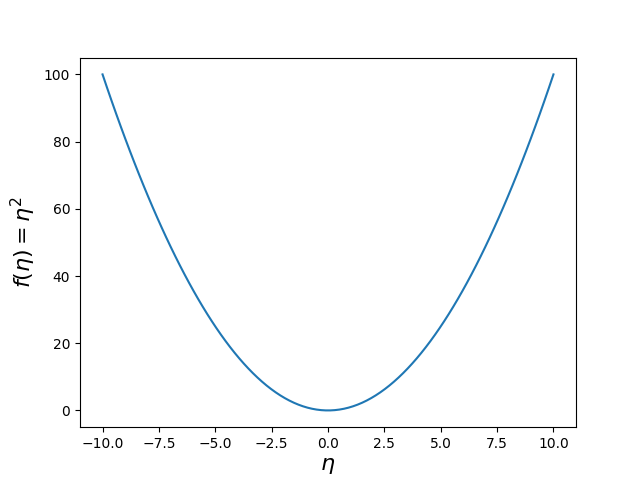

### Legends

If you have multiple data sets on a single plot it is useful to differentiate them with different
line colours, line styles, and/or marker styles. By default Matplotlib will use different colours
for multiple data sets, but as shown above you can control what line colours are used.

You can add labels to each data set that you plot using the `label` keyword argument to `plot`.
These "labels" can then be used in a legend using the
[`legend`](https://matplotlib.org/stable/api/_as_gen/matplotlib.pyplot.legend.html#matplotlib.pyplot.legend)
function.

```python
rng = np.random.default_rng()

x = np.arange(10)

# create from data sets
y1 = rng.normal(len(x))  # noise
y2 = rng.normal(len(x)) + 3 * x  # noise and line
y3 = rng.normal(len(x)) + 1.5 * x ** 2  # noise and quadratic

# plot data with labels
plt.plot(x, y1, color="b", label="Data 1")
plt.plot(x, y2, color="r", label="Data 2")
plt.plot(x, y3, color="g", label="Data 3")

plt.xlabel(r"$x$")
plt.ylabel(r"$y$")

# add legend
plt.legend()
plt.show()
```

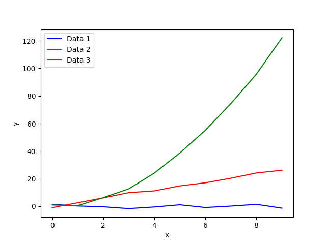

By default the location of the legend will be set to try and avoid overlapping with most of the
data. The legend location can be set explicitly to a particular place using the `loc` keyword
argument and a location string, e.g.,:

 * `"upper right"`
 * `"upper left"`
 * `"lower right"`
 * `"lower left"`

### Axis limits

Matplotlib will automatically try and determine the range of values shown in the x- and y-axes.
However, you can manually set the axis ranges to whatever you require using the
[`xlim`](https://matplotlib.org/api/_as_gen/matplotlib.pyplot.xlim.html#matplotlib.pyplot.xlim) and
[`ylim`](https://matplotlib.org/api/_as_gen/matplotlib.pyplot.ylim.html#matplotlib.pyplot.ylim)
functions in `pyplot`. These functions take in a list, or tuple, containing two values: the lower
and upper ends of the range. For example:

```python
x = np.linspace(-10, 10, 100)
y = 3.5 - 2.3 * x + 0.5 * x ** 2  # a more complex quadratic

# plot the data
plt.plot(x, y)

# zoom in on an x-range from -5 to 5
plt.xlim([-5, 5])

# zoom in on a y-range from -5 to 25
plt.ylim([-5, 25])

plt.xlabel(r"$x$")
plt.ylabel(r"$y$")

plt.show()
```

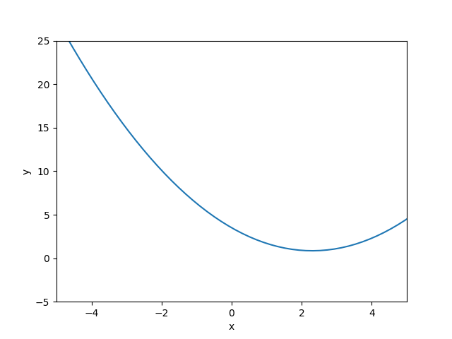

### Grid lines

Sometimes it is useful to add a background grid to a figure to aid visualisation. This can be added
using the
[`grid`](https://matplotlib.org/api/_as_gen/matplotlib.pyplot.grid.html?highlight=grid#matplotlib.pyplot.grid)
function in `pyplot`. By default the grid lines are applied to both the x- and y-axes, but this can
be specified with the `axis` keyword argument, e.g., `axis="x"` to just add a grid on the x-axis.

```python
x = np.linspace(-10, 10, 100)
y = 3.5 - 2.3 * x + 0.5 * x ** 2  # a more complex quadratic

# plot the data
plt.plot(x, y)

plt.xlabel(r"$x$")
plt.ylabel(r"$y$")

# turn on the grid
plt.grid()

plt.show()
```

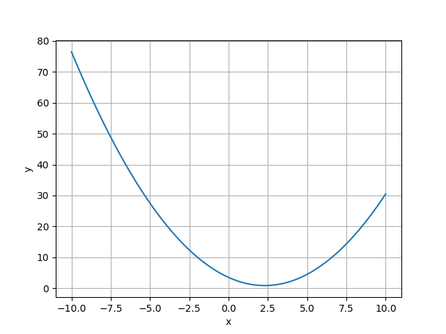

### Logarithmic axes

If you have (positive) data that spans over many orders of magnitude it is often useful to plot the
logarithm of the data. There are three `pyplot` functions that enable you to do this:

 * [`loglog`](https://matplotlib.org/api/_as_gen/matplotlib.pyplot.loglog.html#matplotlib.pyplot.loglog) - plot the base-10 logarithm of data on both the x- and y-axes;
 * [`semilogx`](https://matplotlib.org/api/_as_gen/matplotlib.pyplot.semilogx.html#matplotlib.pyplot.semilogx) - plot the x-axis on a logarithmic scale, but the y-axis on a linear scale;
 * [`semilogy`](https://matplotlib.org/api/_as_gen/matplotlib.pyplot.semilogy.html#matplotlib.pyplot.semilogy) - plot the y-axis on a logarithmic scale, but the x-axis on a linear scale.

For example:

```python
x = np.logspace(-5, 5, 100)  # linearly spaced in base-10 log space
y = 2.5 * x ** 4.5

# plot the data in log-log space
plt.loglog(x, y)

plt.xlabel(r"$x$")
plt.ylabel(r"$y$")

# turn on the grid
plt.grid()

plt.show()
```

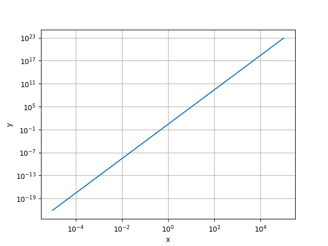

## Basic scatter plot

The `plot` function will produce a line plot, but by setting the line style to be `"None"` and
explicitly giving a marker style it can be used to produce a scatter plot, i.e., a plot of
individual points, e.g.,

```python
# produce some random points
x = np.random.randn(200)
y = np.random.randn(200)

# plot data points using circle markers
plt.plot(x, y, linestyle="None", marker="o")
plt.xlabel(r"$x$")
plt.ylabel(r"$y$")
plt.show()
```

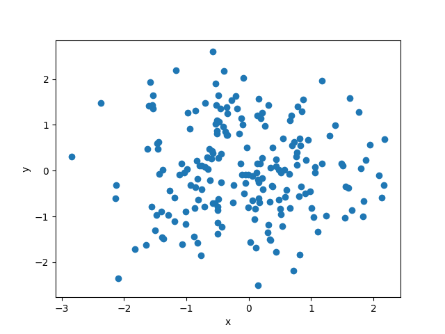

An alternative is to the use
[`scatter`](https://matplotlib.org/api/_as_gen/matplotlib.pyplot.scatter.html?highlight=scatter#matplotlib.pyplot.scatter)
function in `pyplot`. This adds the ability to add an additional dimension of information to the
plot in the form the size and/or colour of the points, using the `s` and `c` keyword arguments,
respectively. For example,

```python
# produce some random points
x = np.random.randn(200)
y = np.random.randn(200)

# third dimension
z = 10 / np.sqrt(x ** 2 + y ** 2)

# plot data using scatter, with size and colour representing "z" data
plt.scatter(x, y, s=z, c=z)
plt.colorbar()
plt.xlabel(r"$x$")
plt.ylabel(r"$y$")
plt.show()
```

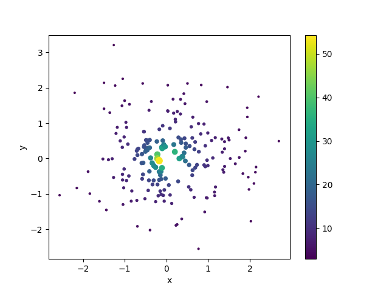

In the above example the
[`colorbar`](https://matplotlib.org/api/_as_gen/matplotlib.pyplot.colorbar.html?highlight=colorbar#matplotlib.pyplot.colorbar)
function has been used to add a colour bar on the right hand side representing the z-axis values.

!!! note
    You can plot with different plotting functions on the same plot, i.e., the `plot` function and
    the `scatter` function, e.g.,

    ```python
    x = np.random.randn(200)
    y = np.random.randn(200)
    z = 10 / np.sqrt(x ** 2 + y ** 2)

    # plot data using scatter, with colour representing "z" data
    plt.scatter(x, y, c=z)

    # overplot a line plot
    linex = np.linspace(-4, 4, 10)
    liney = 1.5 + linex + 0.5
    plt.plot(linex, liney, color="r")

    plt.show()
    ```

    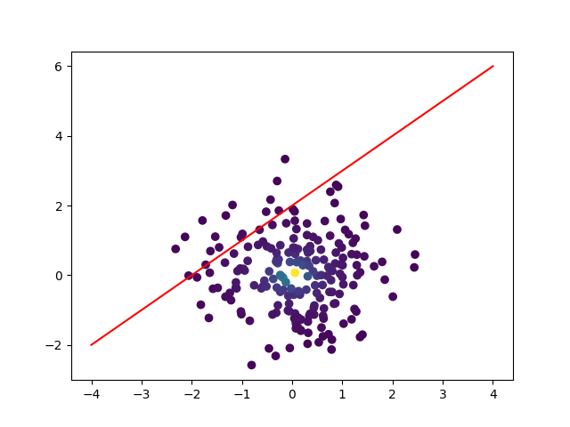

## Basic histogram

Sometimes you need to count the number of data points within a set ranges of values. This is called
"binning", i.e., a count of the data in each "bin" or interval. A plot of the binned data is called
a histogram and this can be made using the
[`hist`](https://matplotlib.org/api/_as_gen/matplotlib.pyplot.hist.html?highlight=hist#matplotlib.pyplot.hist)
function in `pyplot`.

For example, if we had measured the speed of a set of particles we could look at the distribution
of speeds using a histogram:

```python
# create a set of Hydrogen atoms at ~room temperature
from scipy.stats import maxwell
m = 1.67e-27  # proton mass (kg)
kb = 1.38e-23  # Boltzmann constant (m^2 ks s^-2 K^-1)
T = 300  # temperature (K)

natoms = 100000  # number of atoms
speeds = maxwell.rvs(scale=np.sqrt(kb * T / m), size=natoms)

# plot distribution of atom speeds
plt.hist(speeds, bins=100)
plt.xlabel("Speed (m/s)")
plt.ylabel("Counts")
plt.show()
```

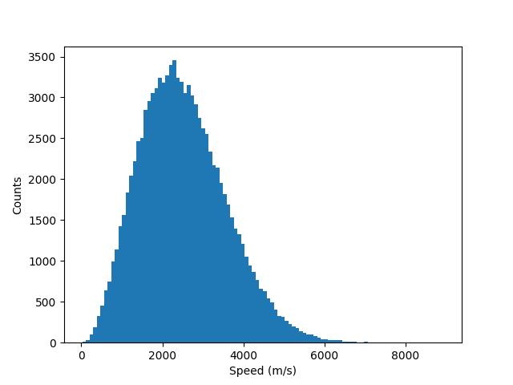

In the above example, the number of "bins" has been set to 100 using `bins=100`, and the `hist`
function has created 100 equal size bins between the smallest and largest values (`bins` defaults to
10 bins). The `bins` keyword argument can also be set using an array of bin edge values, which do
not have to be the same size.

To create a histogram that is normalised, i.e., the y-axis does not represent counts, but instead
makes the area under the curve equal to one, you can set the `density` keyword argument to `True`.

An example showing two normalised histograms, one filled with colour, and the other unfilled, is
shown below:

```python
# create a set of Hydrogen atoms at ~room temperature
m = 1.67e-27  # proton mass (kg)
kb = 1.38e-23  # Boltzmann constant (m^2 ks s^-2 K^-1)
T = 300  # temperature (K)

natoms = 100000  # number of atoms
Hspeeds = maxwell.rvs(scale=np.sqrt(kb * T / m), size=natoms)

# create a set of Helium atoms at room temperature
Hespeeds = maxwell.rvs(scale=np.sqrt(kb * T / (4 * m)), size=natoms)

# plot probability density of speed distributions
plt.hist(Hspeeds, bins=50, density=True, color="b",
         histtype="stepfilled", alpha=0.5, label="Hydrogen")
plt.hist(Hespeeds, bins=50, density=True, color="r",
         histtype="step", label="Helium")
plt.xlabel("Speed (m/s)")
plt.ylabel("Probability density")
plt.legend()
plt.show()
```

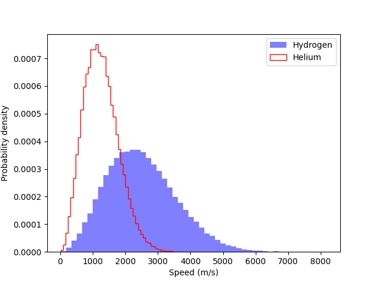

The `hist` function can also be used to plot the cumulative distribution, e.g.,

```python
# set bins edges
bins = np.linspace(
    min([Hspeeds.min(), Hespeeds.min()]),
    max([Hspeeds.max(), Hespeeds.max()]),
    100
)

plt.hist(Hspeeds, bins=bins, cumulative=True, density=True, color="b",
         histtype="step", label="Hydrogen")
plt.hist(Hespeeds, bins=bins, cumulative=True, density=True, color="r",
         histtype="step", label="Helium")
plt.xlabel("Speed (m/s)")
plt.ylabel("Cumulative probability")
plt.legend(loc="lower right")

# set some limits
plt.xlim([bins[0], bins[-1]])
plt.ylim([0, 1])

plt.show()
```

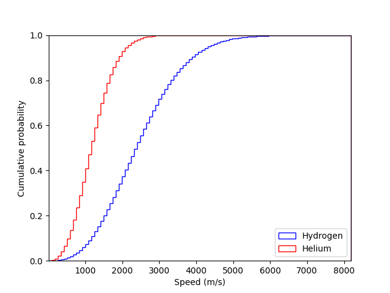

## Saving figures

If using the `show` function to display figures the easiest way to save them is using the disk icon
:floppy_disk: in the display window as shown below.

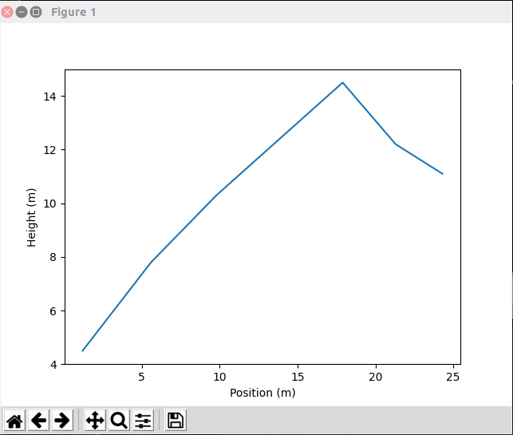

This will open up a file browser where you can type in the output file name. The file extension that
you give determines what image format the plot is saved as. Some standard image formats are:

 * [PNG](https://en.wikipedia.org/wiki/Portable_Network_Graphics) - use the `.png` extension, e.g.,
   "`myimage.png`"
 * [JPEG](https://en.wikipedia.org/wiki/JPEG) - use the `.jpg` extension, e.g., "`myimage.jpg`"
 * [PDF](https://en.wikipedia.org/wiki/PDF) - use the `.pdf` extension, e.g., "`myimage.pdf`"
 * [EPS](https://en.wikipedia.org/wiki/Encapsulated_PostScript) - use the `.eps` extension, e.g.,
   "`myimage.eps`"

For publication quality plots it is often good to save images as PDF files.

Displaying plots using `show` is useful when using a Python terminal or testing your code. But,
generally within a script you do not want the plot to be displayed, you just want it created and
saved. As mentioned above, by default when using `show` the code after that statement will not be
executed until the image window has been closed, which means you have to manually intervene during
code running.

Plots can be saved within the code using the
[`savefig`](https://matplotlib.org/api/_as_gen/matplotlib.pyplot.savefig.html#matplotlib.pyplot.savefig)
function in `pyplot`. For example, to save a plot to a PDF file, you could use:

```python
position = [1.2, 5.6, 9.8, 17.9, 21.3, 24.3]
height = [4.5, 7.8, 10.3, 14.5, 12.2, 11.1]
 
plt.plot(position, height) 
plt.xlabel("Position (m)") 
plt.ylabel("Height (m)") 

# save the figure
plt.savefig("myplot.pdf")
```

If saving a plot to a PNG or JPEG format, you can set the resolution of the output image using the
`dpi` ("dots per inch") keyword argument. Generally a `dpi=150` is good enough for most purposes.

### Tight layout

Often figures will be produced with excessive amounts of whitespace around the edges. Matplotlib can
try and optimise the spacing to remove some of this excess by using the
[`tight_layout`](https://matplotlib.org/api/_as_gen/matplotlib.pyplot.tight_layout.html) function in
`pyplot`:

```python
position = [1.2, 5.6, 9.8, 17.9, 21.3, 24.3]
height = [4.5, 7.8, 10.3, 14.5, 12.2, 11.1]
 
plt.plot(position, height) 
plt.xlabel("Position (m)") 
plt.ylabel("Height (m)")

# use tight layout
plt.tight_layout()
plt.savefig("myimage.png", dpi=150)
```

The image below shows the plot produced with the above code both with and without `tight_layout` on
the left and right, respectively.

<table>
  <tr>
    <td>
      
    </td>
    <td>
      
    </td>
  </tr>
</table>

## Customisation

The above examples have only scratched the surface of what Matplotlib can do. Here we will look at a
few options that let you have a bit more control over the look of the figures.

### Using axes and figures objects

In all the above examples we have just used `pyplot` functions to make a single figure. This figure
has a standard default size and shape and we can only control one figure at a time.

A more useful way to create a figure is using the
[`subplots`](https://matplotlib.org/api/_as_gen/matplotlib.pyplot.subplots.html#matplotlib.pyplot.subplots)
function in `pyplot`.

!!! note
    There is also the simpler
    [`figure`](https://matplotlib.org/api/_as_gen/matplotlib.pyplot.figure.html#matplotlib.pyplot.figure)
    function, but `subplots` can work in the same way as `figure`, but also allows multiple plots
    as discussed [below](#multiple-plots-in-a-figure).

You can create a single figure with `subplots` using:

```python
fig, ax = plt.subplots()
```

When created the figure will not contain anything, but the function returns a
[`Figure`](https://matplotlib.org/api/_as_gen/matplotlib.figure.Figure.html#matplotlib.figure.Figure)
object (in the variable `fig` here) and an
[`Axes`](https://matplotlib.org/api/axes_api.html#matplotlib.axes.Axes) object (in the variable `ax`
here).

Data can be added to the figure through the `Axes` object which has methods for all of the `pyplot`
plotting functions discussed above (e.g., `plot`, `scatter` and `hist`):

```python
# add some data to the axes
x = np.linspace(-10, 10, 100)
y = 3.5 - 2.3 * x + 0.5 * x ** 2  # a more complex quadratic

# plot the data
ax.plot(x, y)

# add axis labels
ax.set_xlabel(r"$x$")
ax.set_ylabel(r"$y$")

# set limits
ax.set_xlim([-7, 7])
ax.set_ylim([-5, 30])

# save the plot
fig.tight_layout()
fig.savefig("myplot.png", dpi=150)
```

Above it can be seen that some things have been done differently. To set the axis labels the
[`set_xlabel`](https://matplotlib.org/api/_as_gen/matplotlib.axes.Axes.set_xlabel.html#matplotlib.axes.Axes.set_xlabel)
and
[`set_ylabel`](https://matplotlib.org/api/_as_gen/matplotlib.axes.Axes.set_ylabel.html#matplotlib.axes.Axes.set_ylabel)
methods of the `Axes` class have had to be used rather than the `pyplot.xlabel` and `pyplot.ylabel`
functions. The axes limits have also been set using
[`set_xlim`](https://matplotlib.org/api/_as_gen/matplotlib.axes.Axes.set_xlim.html#matplotlib.axes.Axes.set_xlim)
and
[`set_ylim`](https://matplotlib.org/api/_as_gen/matplotlib.axes.Axes.set_ylim.html#matplotlib.axes.Axes.set_ylim)
methods of the `Axes` class. Finally, the `tight_layout` and `savefig` methods of the `Figure` class
have been used.

By having the figures as variables we can create multiple figures within the same code.

We can also make use of the `figsize` keyword argument to set the size of the figures, which takes a
tuple containing the width and height of the figure (in inches). For example we could create two
plots, with different aspect ratios, using:

```
# a narrow plot
fig1, ax1 = plt.subplots(figsize=(4, 10))

# plot something on this axes
ax1.hist(np.random.rand(1000))

# a wide plot
fig2, ax2 = plt.subplots(figsize=(10, 4))

ax2.hist(np.random.randn(1000), bins=20)

# save the figures
fig1.savefig("narrow.png")
fig2.savefig("wide.png")
```

<table>
  <tr>
    <td style="vertical-align:bottom">
      
    </td>
    <td style="vertical-align:bottom">
      
    </td>
  </tr>
</table>

### Multiple plots in a figure

Sometimes it is useful to plot related data on the same figure, but in a separate plot. Using
`subplots` multiple plots can be added to the same figure. For example, we can create one plot above
another, and have them share the same x-axis (i.e., the same range and positioning of x-axis label):

```python
fig, axs = plt.subplots(nrows=2, ncols=1, sharex=True)

# create some data
x = np.linspace(0.0, 2.0 * np.pi, 100)

y1 = np.sin(x)
y2 = np.cos(x)

# axs is now an array with the shape nrows x ncols
axs[0].plot(x, y1, color="blue")
axs[1].plot(x, y2, color="red")

# set axes labels
axs[1].set_xlabel(r"$\phi$")  # only set x-axis label on bottom plot
axs[0].set_ylabel(r"$\sin(\phi)$")
axs[1].set_ylabel(r"$\cos(\phi)$")

fig.tight_layout()
fig.savefig("trigfuncs.png")
```

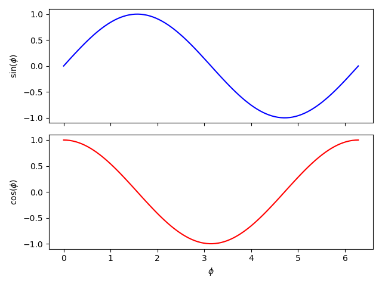

Similarly, side-by-side plots can share the same y-axis if required.

!!! note
    More complex plot grids can be defined using the
    [`gridspec`](https://matplotlib.org/stable/tutorials/intermediate/gridspec.html#sphx-glr-tutorials-intermediate-gridspec-py) module.

### Setting up default parameters

There are a wide range of default settings used within Matplotlib when creating and saving a plot.
These can be found through the
[`rcParams`](https://matplotlib.org/tutorials/introductory/customizing.html#matplotlib-rcparams)
object:

```python
from matplotlib import rcParams
# show rcParams (truncated here)
print(rcParams)
_internal.classic_mode: False
agg.path.chunksize: 0
animation.avconv_args: []
animation.avconv_path: avconv
animation.bitrate: -1
animation.codec: h264
animation.convert_args: []
animation.convert_path: convert
animation.embed_limit: 20.0
animation.ffmpeg_args: []
animation.ffmpeg_path: ffmpeg
animation.frame_format: png
animation.html: none
animation.html_args: []
animation.writer: ffmpeg
axes.autolimit_mode: data
axes.axisbelow: line
axes.edgecolor: black
axes.facecolor: white
axes.formatter.limits: [-5, 6]
...
```

There are [multiple methods](https://matplotlib.org/tutorials/introductory/customizing.html) to
manually adjust these defaults, but the one we will show is to directly edit the `rcParams` object.
For example, we can change the default font and font size, and the default figure size, with:

```python
from matplotlib import rcParams

rcParams["font.family"] = "serif"  # change to default to a serif font
rcParams["font.serif"] = "Times New Roman"  # change the default serif font to Times New Roman
rcParams["font.size"] = 14  # change the default font size
rcParams["figure.figsize"] = [9.7, 6]  # change the default figure size
rcParams["figure.autolayout"] = True  # automatically apply tight_layout

from matplotlib import pyplot as plt

fig, ax = plt.subplots()

x = np.linspace(-10, 10, 100)
y = 3.5 - 2.3 * x + 0.5 * x ** 2  # a more complex quadratic

# plot the data
ax.plot(x, y)

# add axis labels
ax.set_xlabel(r"$x$")
ax.set_ylabel(r"$y$")

fig.savefig("myfigure.png")
```

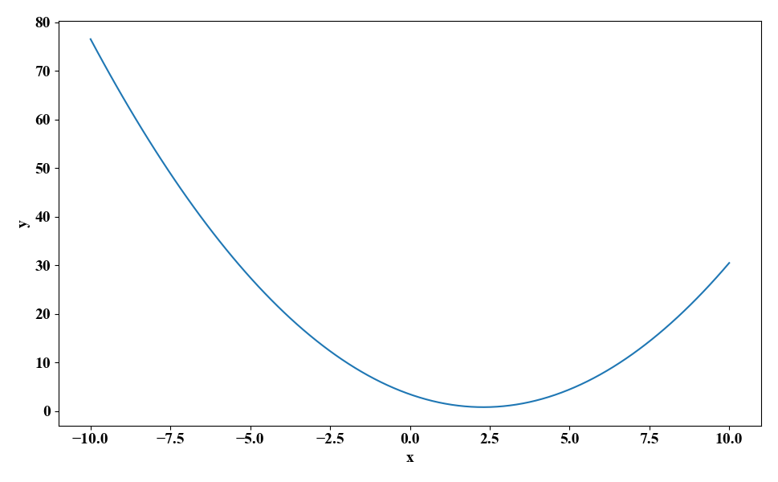

!!! note
    Any changes you make to `rcParams` in a script or Python terminal session will only be applied
    to that script/session. If you start a new session, or run a new script, the original defaults
    will be reverted too. To keep the defaults across multiple runs/scripts you can define your own
    custom [configuration file](https://matplotlib.org/tutorials/introductory/customizing.html#the-matplotlibrc-file)
    or [style file](https://matplotlib.org/tutorials/introductory/customizing.html#defining-your-own-style).
