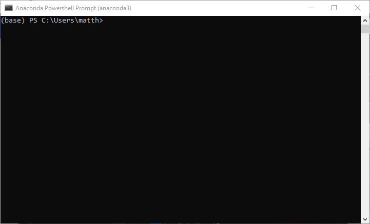
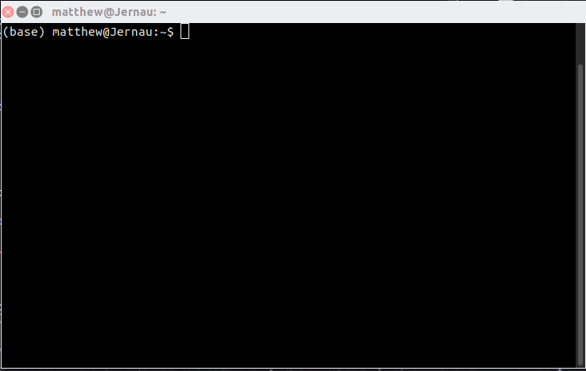

# Using a terminal

<iframe width="560" height="315" src="https://www.youtube.com/embed/K9HtfYx1hOQ" frameborder="0" allow="accelerometer; autoplay; clipboard-write; encrypted-media; gyroscope; picture-in-picture" allowfullscreen></iframe>

As described in the [_VS Code_](../demo-vs-code/index.html) introduction, any Python code that you
write can be run within [_VS Code_](../demo-vs-code/index.html#running-code). However, it use also
useful to know how run code and navigate a file system using a @(terminal) (sometimes referred to as
a Command Prompt window, console or @(shell)). Indeed, a Python code interpreter can be run
interactively via a terminal as will be described in [another
tutorial](../demo-python-terminal/index.html).

A terminal is a text-based window that allows you to type and run commands. There are different
terminal programs for different operating systems, the most common being:

=== "Windows"
    [**PowerShell Prompt**](https://docs.microsoft.com/en-us/windows-server/administration/windows-commands/powershell)

    !!! note
        If you have installed [Anaconda](../demo-anaconda/index.html) you should access the
        PowerShell using the "Anaconda PowerShell Prompt", which automatically starts the terminal
        with the ability to run `conda` commands and within @(virtual environments), instead of the
        standard Windows PowerShell.

    Open this by either:

    * clicking the Windows start :fontawesome-brands-windows: button and scrolling to find
      "Anaconda Powershell Prompt (anaconda3)" within the "Anaconda3 (64-bit)" menu;
    * or, searching for "PowerShell" in the search bar and selecting "Anaconda Powershell Prompt".

    

    The "Anaconda Powershell Prompt" can also be launched from within the
    [_Anaconda Navigator_](../demo-anaconda/index.html#anaconda-navigator).

=== "Mac OS"
    [**Terminal App**](https://support.apple.com/en-gb/guide/terminal/apd5265185d-f365-44cb-8b09-71a064a42125/mac)

    Open this by either:

    * clicking the Launchpad icon, type "Terminal" in the search bar and then clicking on Terminal;
    * or, in Finder, opening the "Applications/Utilities" folder and double clicking on Terminal.

=== "Linux"
    There are a wide variety of terminal applications that come with different Linux distributions
    and desktop environments.

    In most distributions a terminal can be opened using the key combination ++ctrl+alt+t++,
    although there may also be an icon in a launcher panel, or it can be found through the desktop
    environment's search functionality.

    

Within a terminal, the line you input commands onto is called the @(command line) and it starts with
some characters called the @(command prompt):

=== "Windows"
    The PowerShell @(command prompt) will generally end in a `>` character and contain the path of
    the current directory.

=== "Mac OS/Linux"
    The command prompt will often end with a `$` or `#` character.

If you have installed Anaconda, the command prompt should start with the name of the Anaconda
environment in brackets, e.g., `(base)` for the default environment.

A terminal might sometimes be referred to as a "@(shell)"; the shell is a program that runs within
the terminal and is what you actually interact with when running commands. Another common term used
to describe a terminal is a "console". Despite subtly different meanings terminal, console and shell
are often used interchangeably.

!!! note
    In a Mac OS/Linux terminal there are a variety of different @(shells) that you can use with
    slightly different syntaxes and abilities (shells are themselves programming languages), but on
    most distributions the default shell is called
    [bash](https://en.wikipedia.org/wiki/Bash_(Unix_shell)).

## Terminal "cheat sheet"

Below we will go through a few of the basic commands, with examples, to help navigate using a
terminal. If there is a different syntax between Windows, Mac OS, or Linux these will be given. For
Windows these commands assume you are using the PowerShell and not a different terminal program.

Two useful features (among others) of a terminal are:

1. command history: the ability to toggle back (and then forward) through previous commands you
   have typed using arrow keys ++up++ and ++down++;
2. tab completion: the ability to autocomplete a known command or filename using the tab ++tab++
   key.

!!! note
    The examples shown below start with a command prompt character, in these cases either `>` or
    `$`, which does not need to be typed.

### Show the current directory path

`pwd`

When you open a terminal there will be a default directory that the command prompt will be based in.
To find out what this directory is, if not known, you can run, e.g.:

=== "Windows"
    ```
    > pwd

    Path
    ----
    C:\Users\username
    ```

=== "Mac OS/Linux"
    ```bash
    $ pwd
    /home/username
    ```

### Change between directories

=== "Windows"
    `chdir` or `cd`

=== "Mac OS/Linux"
    `cd`

You can change to a new directory using either its path relative to the current directory you are
in, or using the absolute path, i.e., the full path from the drive or base directory name, e.g.,

```
# move to a directory called level1 within the current directory using its relative path
$ cd level1

# move to a directory called level2 specifying its full path
$ cd C:\Users\username\level2
```

To move down one directory level use two dots, e.g.,:

```bash
$ cd ..
```

### List the contents of a directory

=== "Windows"
    `dir` or `ls`

    To list the contents of the current directory (in alphabetical order) use:

    ```
    > dir

        Directory: C:\Users\username

    Mode               LastWriteTime           Length Name
    ----               -------------           ------ ----
    d-----      04/09/2020     16:03                  .conda
    d-----      04/09/2020     19:33                  anaconda3
    -a----      09/09/2020     12:34               10 test.txt
    ```

    The "Mode" shows "`d-----`" for a directory and "`-a----`" for "archive", i.e., a file.

    To list the contents of a particular directory supply either the relative or absolute path, e.g.,:

    ```bash
    > dir C:\Users\username
    ```

=== "Mac OS/Linux"
    `ls`

    To list the contents of the current directory (in alphabetical order) use:

    ```bash
    $ ls
    alphabet.txt
    Bookmarks
    notes.pdf
    ```

    To also list the attributes (e.g., accessibility, file creator, file size, date of last change)
    of files and directories use the `-l` flag, e.g.,:

    ```
    $ ls -l
    -rw-r--r--  1 username username    4096 Aug 10 22:06  alphabet.txt
    drwxr-xr-x  2 username username    4096 Jan 12  2018  Bookmarks
    -rw-r--r--  1 username username
    ```
    
    A `d` at the start of the attributes indicates a directory, while a `-` is a file. The other
    letters (`r`, `w`, and `x`) represent whether, and by whom, the files are readable, writable
    and executable, respectively.

    To colourise the output, i.e., give files and directories different colours depending on their
    types the `--color=auto` flag can be used.

    To list the contents of a particular directory supply either the relative or absolute path, e.g.,:

    ```bash
    $ ls /home/username
    ```

### Make a new directory

`mkdir`

E.g., make a directory called `Project` in the current directory:

```bash
$ mkdir Project
```

Or, make new directory based on an absolute of relative path, e.g.,:

=== "Windows"
    ```
    > mkdir C:\Users\username\Project
    ```

=== "Mac OS/Linux"
    ```bash
    $ mkdir /home/username/Project
    ```

### Show the content of a text file

=== "Windows 10"
    `more` or `type`

=== "Mac OS/Linux"
    `more`, `less`, or `cat`

    For short files, that can be displayed fully within the terminal window the `more` and `cat`
    commands are essentially equivalent (note that `cat` can actually be used to concatenate the
    content of many files). For longer files `cat` will output the whole content in one go while
    `more` will output just what fits on the screen and the content can be scrolled through with
    the ++enter++ key.

E.g., to show the contents of a text file called `numbers.txt` in the current directory, which
contains a column of numbers, use:

```bash
$ more numbers.txt
1
2
3
4
```

Relative or absolute file paths can be used for files not in the current directory.

### Run a Python script

To run a Python script, e.g., one called `myscript.py`, that is in you current directory, use:

```bash
python myscript.py 
```

The full or relative path to the script could also be used.

### Open an Python terminal session

To open a Python terminal session (see the [Python terminal
tutorial](../demo-python-terminal/index.html)) type:

```bash
python 
```

### Open an interactive Python terminal session

To open an "Interactive Python" session (see the [IPython
tutorial](../demo-python-terminal/index.html#ipython-terminal)) type:

```bash
ipython
```
