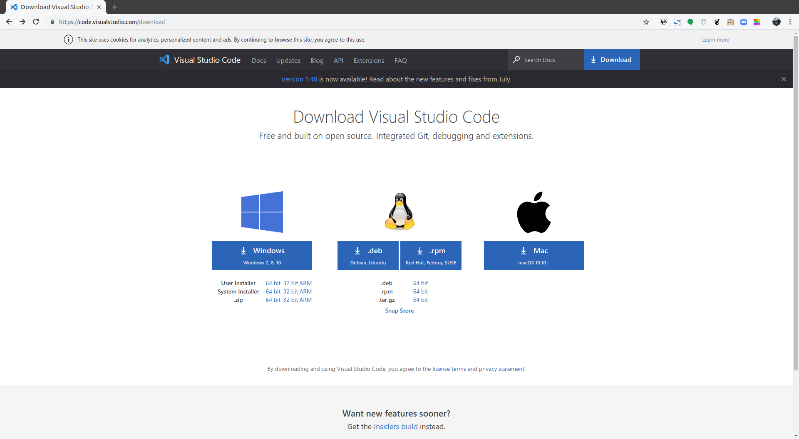
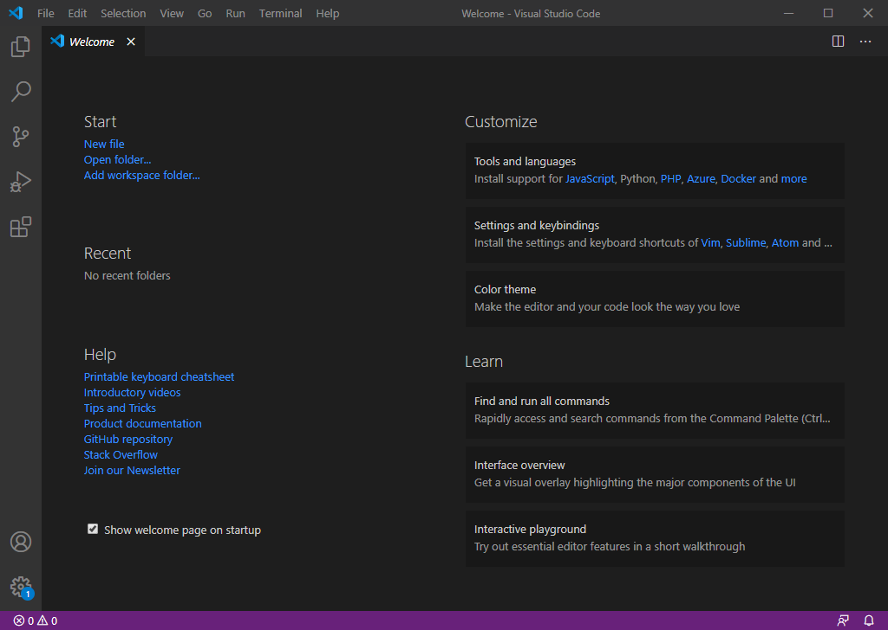
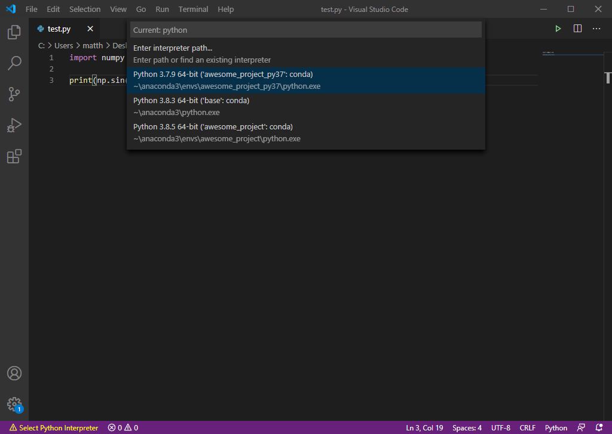
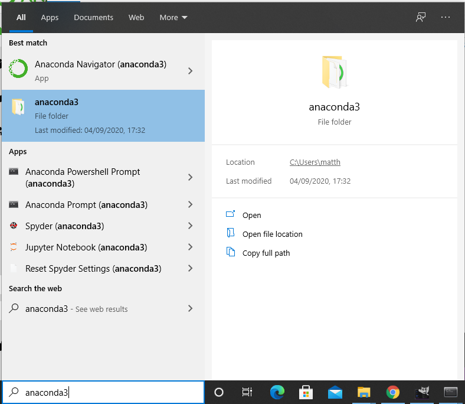
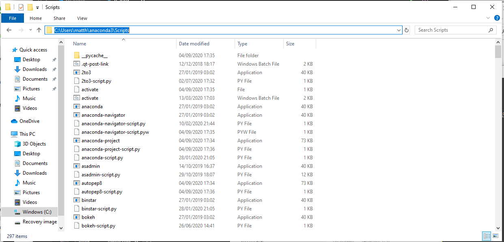
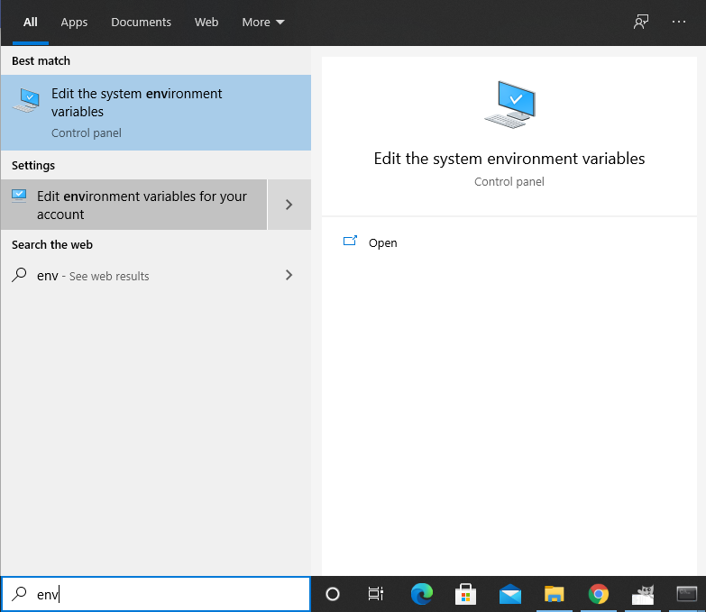
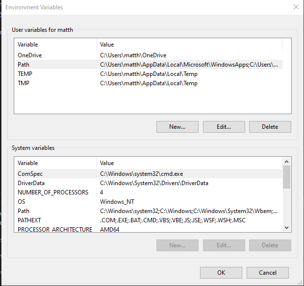
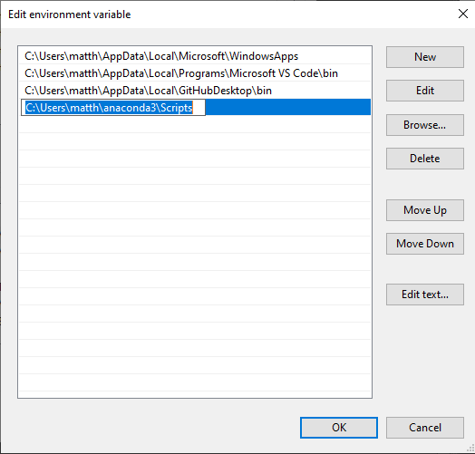
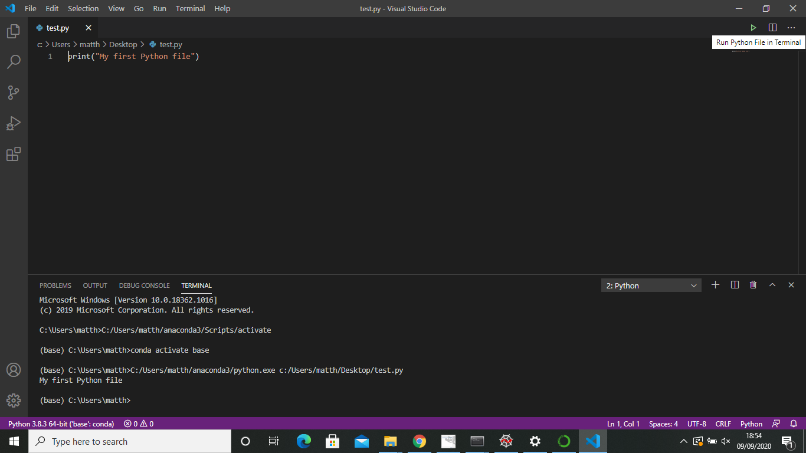

# VS Code

<iframe width="560" height="315" src="https://www.youtube.com/embed/JNLeIQdez68" frameborder="0" allow="accelerometer; autoplay; clipboard-write; encrypted-media; gyroscope; picture-in-picture" allowfullscreen></iframe>

[Visual Studio (VS) Code](https://code.visualstudio.com/) is a text
editor produced by Microsoft.  It can be used for writing and editing
any plain text file, and therefore is mostly used for writing
code. The main useful features for code editing are @(syntax
highlighting) and code @(linting).  Many other excellent text editors
are available (e.g., _Emacs_ or _vim_ or ...); if you already have a
preferred text editor that you are happy with, please skip this section.

!!! note
    You will only need to install VS Code if using your own machine. If using AppsAnywhere on a
    Lancaster University machine you can launch _VS Code_ along with Anaconda.

## Installing VS Code

The instructions below should cover installation of _VS Code_ on Windows, although there should only
be minor differences for other operating systems:

* Visit [https://code.visualstudio.com/download](https://code.visualstudio.com/download) in your web
  browser (or just Google "VS Code download"). Click the appropriate large blue button to download
  the installer file for your operating system.



* Click on the downloaded installer file at the bottom of your browser (the Windows file will be
  named something like `VSCodeUserSetup-x64-1.48.2.exe` where `1.48.2` was the current version at
  the time of writing, but this may have increased). Follow the instructions given in the dialogue
  boxes.
* Accept the license agreement and click ++"Next"++.
* Leave the default install location unchanged (unless you have a preferred install location) and
  click ++"Next"++.
* Leave the default "Start Menu Folder" name unchanged and click ++"Next"++.
* For "Select Additional Tasks" leave the tick boxes unchanged (the "Add to PATH" box should be
  ticked by default) and click ++"Next"++.
* Click ++"Install"++.
* Click ++"Finish"++ and _VS Code_ should launch.

On an Apple Mac, you may need to move the executable file for _VS
code_ from your "Downloads" folder to your "Applications" folder.

## Using VS Code

Introductory videos on using and customising various aspects of _VS Code_ can be found at
[https://code.visualstudio.com/docs/getstarted/introvideos](https://code.visualstudio.com/docs/getstarted/introvideos),
but we will cover some of the basics here.

### Launching VS Code

In you have previously installed the full installation of [Anaconda](demo-anaconda.md)
then once _VS Code_ is installed it will appear as an application that can be launched from the
_Anaconda Navigator_. Alternatively, it can be opened via a standard way of opening an application:

!!! tip
    It is recommended that you launch _VS Code_ via _Anaconda Navigator_ as it is simpler to
    then interact with the Python environments that Anaconda creates.

=== "Anaconda Navigator"
    * Start _Anaconda Navigator_, e.g., in Windows click on the start :fontawesome-brands-windows:
      button and find and click on the "Anaconda3 (64-bit)" menu, then click on "Anaconda
      Navigator (anaconda3)".
    * In the ":fontawesome-solid-house: Home" tab, choose the environment you want to use by
      selecting it in the "Application on" dropdown menu (defaulting to `base (root)`).
    * Scroll to find the ":material-microsoft-visual-studio-code: VS Code" application panel and
      click the ++"Launch"++ button.

=== "Without Anaconda"
    If you have added a _VS Code_ startup icon to your taskbar or desktop you can just click on
    that, alternatively:
    
    === "Windows"
        * Click on the start :fontawesome-brands-windows: button and find the "Visual Studio Code" menu.
        * Click on this and then "Visual Studio Code" menu item to launch it.
    === "Mac OS/Linux"
        Open a terminal and type `code`, hit ++enter++ and _VS Code_ should start.

Upon opening _VS Code_ for the first time you will see a Window displaying a welcome screen:



This contains a range of links to help with using _VS Code_

!!! note
    You can disable this welcome message from showing each time you open _VS Code_ by unticking
    the tickbox next to the "Show welcome page on startup".

Down the left hand side of the window are several icons that can be clicked on to open various
panels (clicking again will close the panel):

* :fontawesome-regular-copy:: open the "Explorer" panel showing any currently open
  files.
* :fontawesome-solid-magnifying-glass:: open the "Search" panel to perform "find-and-replace"
  in a file.
* :fontawesome-solid-code-branch:: open the "Source Control" panel, which is useful if you
  code is under [version control](https://en.wikipedia.org/wiki/Version_control), e.g., git,
  mercurial or svn (we will not cover version control in this course).
* :fontawesome-solid-play:: open the "Run" panel to allow you to run and debug code in
  your current file.
* :fontawesome-solid-border-all:: open "Extensions" panel to allow you to install _VS Code_
  [extensions](https://code.visualstudio.com/docs/introvideos/extend).
* :fontawesome-solid-gear:: open the settings manager.

Along the top are various dropdown menus, with the "File" menu providing options for creating new
files, opening existing files and saving files.

Below these menus will be tabs containing any currently opened files. Some useful shortcut keys to
access some of these options are:

* ++ctrl+n++: open a new empty file
* ++ctrl+s++: save a file (opens a file browser to set the file name if saving a new file)
* ++ctrl+o++: open an existing file
* ++ctrl+f++: open a search bar to find text in a file
* ++ctrl+comma++: open a tab containing the _VS Code_ settings
* ++ctrl+f5++: run code
* ++ctrl+shift+grave++: open a terminal

### Installing extensions

_VS Code_ allows you to install a large range of
[extensions](https://marketplace.visualstudio.com/VSCode) that expand its abilities. These include
extensions that can, amongst other things, add @(syntax highlighting), perform code @(linting),
perform spell checking, and rendering/compile LaTeX documents.

The main extension that is useful for this course is the "Python" extension. This enhances _VS
Code_'s abilities when writing Python code. If using _VS Code_ launched via the _Anaconda Navigator_
this extension may already be installed by default. Otherwise, it can be installed by clicking on
the ":fontawesome-solid-border-all: Extensions" panel icon on the left hand side, typing "Python" in
the search bar, and clicking the ++"Install"++ button next to the extension named "Python" and
supplied by Microsoft.

The Python extension will recognise when you have a Python file (see [below](#creating-a-file)) and
perform:

* syntax highlighting, which is the highlighting of known keywords and formatting styles;
* linting, which is automatic checking for _some_ coding errors.

Other useful extension to install include:

* [Code Spell
  Checker](https://marketplace.visualstudio.com/items?itemName=streetsidesoftware.code-spell-checker):
  a spell checker!
* [LaTeX Workshop](https://marketplace.visualstudio.com/items?itemName=James-Yu.latex-workshop): an
  extension for helping and enhancing editing of LaTeX documents.

### Creating a file

To create your first file either click on the "File" dropdown menu and select "New File" or use the
++ctrl+n++ shortcut. This will open a new tab in the _VS Code_ window with the name
":material-format-align-left: Untitled-1" (if you have more than one unsaved file open the name will
increment by one, e.g., "Untitled-2", "Untitled-3", etc).

When you create a file a `1` should appear in the left of the screen. This shows the line number. As
you add more lines of text more line numbers will appear. In the bottom right of the screen there
will be some text saying, e.g., "Ln 1, Col 1", which tells you the line and column number where the
blinking cursor is.

Type some text in the file, e.g.,:

```python
print("My first Python file")
```

and save it by clicking on the "File" dropdown menu and selecting "Save as..." or using the
++ctrl+s++ shortcut. Type in the name that you want to give the file; for files containing Python
code (see the [scripts tutorial](demo-scripts.md)) you should give the file a name that
has the @(file extension) "`.py`", e.g., "`myfirstcode.py`.

!!! tip
    Save files with sensible names and in sensible locations!

    When creating a code project it is useful to create a folder/directory specifically for it and
    make sure you save your files into that folder. Spend some time thinking about where you want
    to store the project and use a descriptive folder name.

    Python file names should ideally not contain spaces or non-alphanumerical characters other
    than hyphens "`-`" or underscores "`_`", e.g., `project_utilities.py` is good, but
    `File Number 1!.py` is bad.

When you save a file with the "`.py`" extension _VS Code_ will recognise it as a Python file. In the
bottom right hand corner of the _VS Code_ window, it should now say the Python version and name of
the Anaconda environment that you are in, e.g. "Python 3.8.3 64-bit ('base': conda)" if using the
default `base` environment. If you run the file (as discussed [below](#running-code)) this will be
the version of Python and environment that is used. If you have multiple environments, you can
switch between them by clicking on this text and choosing the required environment in the menu that
appears.



### Customising the theme

By default _VS Code_ has a [colour scheme](https://code.visualstudio.com/docs/getstarted/themes), or
"theme", with a dark background and light text. You can change this to a variety of provided themes,
such as having a light background and dark text.

To change the colour theme, click on the "File" dropdown menu, then hover over "Preferences" and
click on "Color theme" (or use the ++ctrl+k++ ++ctrl+t++ shortcut). A panel will open up with a
selection of themes, such as "Light (Visual Studio)" (this is what I use!) You can even
[customise](https://code.visualstudio.com/docs/getstarted/themes#_customizing-a-color-theme) or
[create your
own](https://code.visualstudio.com/docs/getstarted/themes#_creating-your-own-color-theme) colour
theme if you want!

### Running code

We will cover running code in a terminal in more detail in [another
tutorial](demo-python-terminal.md), but here will describe how to run code within _VS
Code_:

??? note "Note for Windows users"
    If running _VS Code_ through _Anaconda Navigator_ you can ignore this, but if you installed and
    are running _VS Code_ from outside of the _Ananconda Navigator_ you may need to apply the following
    instructions to run Python code.

    You will need to add the location of the Anaconda installation scripts to something called your
    `PATH` environment variable. First, locate the directory that contains these scripts:

    * Type "anaconda3" into the Windows search bar.
    * Look for a result that says "**anaconda3**" with the words "File folder" underneath.

    

    * Click on that result to open the _File Explorer_ and scroll to find the "Scripts" folder.
    * Double click on the "Scripts" folder to open it and click in the address bar at the top to
      reveal the folder's full path. If you installed Anaconda on your machine, with you as the
      sole user, this path may look something like
      `C:\Users\<username>\anaconda3\Scripts`, where `<username>` is your user name on the machine.

    

    * Copy the path, e.g., right click and select "Copy" or use ++ctrl+c++.
    
    Now, add this path to your `PATH` environment variable:

    * Type "env" into the Windows search bar.
    * Click on "Edit environment variables for your account".

    

    * In the top panel under "User variable for..." click on "Path" and select ++"Edit..."++.

    

    * Select ++"Edit"++ and then paste the Anaconda scripts path from above (right click and
      select "Paste" or use ++ctrl+v++) into the slot below any existing path names, then click
      ++"OK"++.

    

    This should allow _VS Code_ to activate any Anaconda environments that you have defined when
    running code within it.

If you have created and saved a file with a `.py` @(file extension) _VS Code_ will know it is a
Python file and can attempt to run the code contained within it. There are several equivalent way to
run the code:

1. right click within the file and select "Run Python File in Terminal";
2. in the top right corner a green play symbol :fontawesome-solid-play: should appear for Python
   files. Click on this to run the file.

Both those methods will open a @(terminal) at the bottom of the _VS Code_ screen, showing the
command that was used to run the file and any output produced by the code.



Alternatively, you can open a @(terminal) manually by clicking on the "Terminal" dropdown menu,
selecting "New Terminal". Within the terminal, which should initialise with the correct environment,
you can type:

```bash
python myfile.py
```

where `myfile.py` is replaced with your file's name, and potentially the full path if the terminal
does not start in the same directory as the file, e.g.,:

```bash
python C:\User\username\Project1\myfile.py
```
