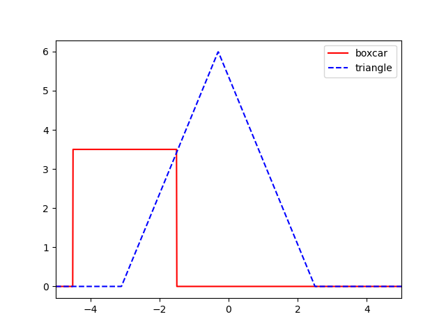
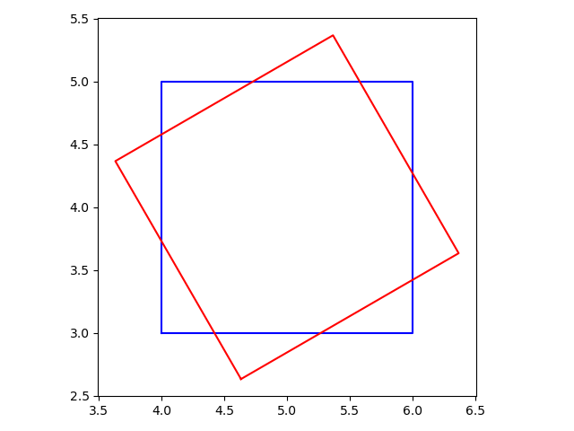

# Exercises

Here are a selection of exercises covering various aspects of the course material. Their aim is to
make you think about how to solve a problem using code. These are not assessed, but you are
encouraged to try these out as the best way to learn to code is to do!

In several cases there are already exist functions, e.g., in NumPy, for performing some of these
exercise problems. While generally you should use existing functions from well maintained libraries
(they will be very well tested and robust), here (unless asked to use an appropriate library) the
aim is for you to think about how you would code up the function yourself.

## Python basics

### Exercise {{ counter() }}

!!! question "Part 1"
    Open a Python/IPython terminal and declare two variables as @(floating point numbers). Add the
    two variables and store the output as a new variable. Print out the new variable value to the
    screen.

??? info "Solution"
    ```console
    $ ipython
    ```

    ```python
    >>> x = 1.2774392  # variable containing a floating point number
    >>> y = -3.4374323  # another variable containing a floating point number
    >>> z = x + y  # add the two variables and store result in z
    >>> print(z)  # print the result z to the screen
    ```

!!! question "Part 2"
    Print out the resulting variable to 3 decimal places.

??? info "Solution"
    Several options exist, e.g.,

    ```python
    >>> print("{0:.3f}".format(z))
    ```

    or

    ```python
    >>> print(f"{z:.3f}")
    ```

    or

    ```python
    >>> print("%.3f" % z)
    ```

!!! question "Part 3"
    Perform the same task, but this time write the code in a text file saved with the `.py`
    extension. Run the code in VS Code and also from the @(command line).

### Exercise {{ counter() }}

!!! question
    In a Python/IPython terminal, or in a script, import an appropriate library to calculate the
    sine of a list of angles that are given in degrees.

??? info "Solution"
    A method using the [`math`](https://docs.python.org/3/library/math.html) library is:

    ```
    import math

    # make a list of angles (assumed to be in degrees)
    angles = [0, 15, 30, 45, 60, 75, 90, 105, 120, 135, 150, 165, 180]

    sines = []
    # loop over angles
    for angle in angles:
        rad = math.radians(angle)  # convert angle to radians
        # rad = angle * math.pi / 180  # an alternative
        sines.append(math.sin(rad))  # calculate sine an append to list
    ```

    A different method using the [`NumPy`](https://numpy.org/doc/stable/index.html) library is:

    ```
    import numpy as np

    rads = np.deg2rad(angles)  # convert angles to radians
    sines = np.sin(rads)
    ```

### Exercise {{ counter() }}

!!! question "Part 1"
    Given a list of numbers, without using the built-in
    [`max()`](https://docs.python.org/3/library/functions.html#max) method, find the maximum value
    in the list. Try two different ways of looping through the list values.

??? info "Solution"
    Two different options are:

    ```python
    x = [-2, 3, 6, -5, 7, 8, 12, -9]

    maximum = x[0]  # use first value as initial comparitor
    for v in x[1:]:
        if v > maximum:
            maximum = v  # update comparitor
    ```

    or (using the [`range()`](https://docs.python.org/3/library/functions.html#func-range) and
    [`len()`](https://docs.python.org/3/library/functions.html#len) functions):

    ```python
    maximum = x[0]
    for i in range(1, len(x)):
        if x[i] > maximum:
            maximum = x[i]
    ```

!!! question "Part 2"
    Given two equal length lists of numbers, create a new list containing the sum of the pairs of
    values from those lists. Try two different methods of doing this.

??? info "Solution"
    Two different options are:

    ```python
    x = [-2, 3, 6, -5, 7, 8, 12, -9]
    y = [0, 12, -5, 2, 8, -8, 11, 2]

    z = []
    for i in range(len(x)):
        z.append(x[i] + y[i])
    ```

    or (using the [`zip()`](https://docs.python.org/3/library/functions.html#zip) function):

    ```python
    z = []
    for vx, vy in zip(x, y):
        z.append(vx + vy)
    ```

!!! question "Part 3"
    Given two equal length lists of numbers, add the numbers from the first list onto the values in
    the second list (do not create a new list).

??? info "Solution"
    Using the [`enumerate()`](https://docs.python.org/3/library/functions.html#enumerate) function
    you can do:

    ```python
    x = [-2, 3, 6, -5, 7, 8, 12, -9]
    y = [0, 12, -5, 2, 8, -8, 11, 2]

    for i, v in enumerate(x):
        y[i] += v
    ```

### Exercise {{ counter() }}

!!! question "Part 1"
    Use list comprehension to generate a list containing the square root of all integers between 1
    and 50.

??? info "Solution"

    ```python
    import math

    sqroots = [math.sqrt(x) for x in range(1, 51)]
    ```

!!! question "Part 2"
    Now use list comprehension to generate the square roots of only even numbers.

??? info "Solution"

    ```python
    import math

    sqroots = [math.sqrt(x) for x in range(1, 51) if x % 2 == 0]
    ```

### Exercise {{ counter() }}

!!! question
    Given a dictionary containing the following information

    ```python
    personaldata = {
        "firstname": "Sammy",
        "lastname": "Scissors",
        "housenumber": 2,
        "streetname": "Long Lane",
        "city": "Lancaster",
        "postcode": "LA1 8TF"
    }
    ```

    construct a single format string that will allow the address to be output in the form:

    ```
    Sammy Scissors
    2 Long Lane
    Lancaster
    LA1 8TF
    ```

??? info "Solution"
    A possible solution is

    ```python
    addressstring = (
        "{firstname} {lastname}\n"
        "{housenumber} {streetname}\n"
        "{city}\n"
        "{postcode}\n"
    )

    print(addressstring.format(**personaldata))
    ```

### Exercise {{ counter() }}

!!! question "Part 1"
    Create an 3x4 (3 rows, 4 columns) array using a list of lists, where each value in the array is
    initialised to be 1.

??? info "Solution"
    The best way is to use list comprehension, e.g.,:

    ```python
    x = [[1 for _ in range(4)] for _ in range(3)]
    ```

!!! question "Part 2"
    Set the corner values of the array to be zero.

??? info "Solution"

    ```python
    x[0][0] = 0
    x[-1][0] = 0
    x[0][-1] = 0
    x[-1][-1] = 0
    ```

### Exercise {{ counter() }}

!!! question "Part 1"
    Create a 2D 3x3 matrix of numbers (using lists). Loop over the rows in the matrix and print out
    the sum of each row.

??? info "Solution"

    ```python
    x = [[0.1, 0.5, 1.2], [-2.3, 4.5, 0.3], [5.7, -0.3, 1.4]]

    # loop over each row
    for row in x:
        print(sum(row))
    ```

!!! question "Part 2"
    Now loop over the columns and print out the products of each column.

??? info "Solution"

    ```python
    # loop over each column
    for i in range(len(x)):
        # column has to be explicitly extracted
        column = [row[i] for row in x]

        product = 1.0
        for cv in colmn:
            product *= cv

        print(product)
    ```

    Note that this is easier with NumPy arrays, for which the rows and column can be transposed, e.g.:

    ```python
    import numpy as np

    y = np.array(x)

    for row in y:
        print(np.sum(row))

    for col in y.T:  # transpose of y
        print(np.prod(col))
    ```

### Exercise {{ counter () }}

!!! question "Part 1"
    Given the following dictionary:

    ```python
    charge = {
        "electron": -1,
        "positron": 1,
        "proton": 1,
        "neutron": 0,
        "up": 2/3,
        "down": -1/3
    }
    ```

    get a list of the dictionary keys and a list of the dictionary values.

??? info "Solution"
    The lists of keys and values can be extracted with:

    ```python
    keys = list(charge.keys())  # need to explicitly convert iterator to list
    values = list(charge.values())
    ```

!!! question "Part 2"
    Add a new particle and it's charge to the dictionary.

??? info "Solution"

    ```python
    charge["strange"] = -1/3
    ```

!!! question "Part 2"
    Find the number of positively charges particles in the dictionary and get a list of their
    names.

??? info "Solution"
    One option is:

    ```python
    npos = 0  # counter for positive particles
    positive = []  # list of positive particles
    for particle, c in charge.items():
        if c > 0:
            npos += 1
            positive.append(particle)
    ```

    Another method, using list comprehension, is:

    ```python
    positive = [c for c in charge.values() if c > 0]
    npos = len(positive)
    ```

### Exercise {{ counter() }}

!!! question "Part 1"
    Create a dictionary with three keys `"a"`, `"b"` and `"c"`, where each key value is an empty list.

??? info "Solution"
    ```python
    data = {"a": [], "b": [], "c": []}
    # alternative
    # data = dict(a=[], b=[], c=[])
    ```

!!! question "Part 2"
    Add another key, `"d"`, into the dictionary that is also an empty list.

??? info "Solution"
    ```
    data["d"] = []
    ```

!!! question "Part 3"
    For each string in the list:

    ```python
    alpha = ["aadb", "bbcd", "aaaa", "bccc", "dddd", "cbcb", "daca"]
    ```

    append the numbers of each letter to the appropriate list in the dictionary.

??? note "Solution"
    ```python
    # loop over the list
    for a in alpha:
        # loop over each letter in the dictionary
        for letter in data:
            # count number of letters in each string
            numlet = a.count(letter)

            # append to list in dictionary
            data[letter].append(numlet)
    ```

### Exercise {{ counter() }}

!!! question
    Suppose you have a set of files containing the results of multiple consecutive
    experiments/simulations. To distinguish the files each file name is suffixed by an integer with
    preceding zeros, such the the number is always 3 digits long (assuming no more than 1000 files
    exist), e.g.,:

    ```
    experimental_results_000.txt
    experimental_results_001.txt
    ...
    experimental_results_258.txt
    experimental_results_259.txt
    ```

    Assuming you know how many files you have and the file name format, how might you loop over all
    the files to read them in?

??? info "Solution"
    A possible solution is:

    ```python
    N = 260  # total number of files

    basename = "experimental_results_{0:03d}.txt"

    # loop over files and read in results
    results = []
    for i in range(N):
        thisfile = basename.format(i)

        # read in the results in some form
        with open(thisfile, "r") as fp:
            results.append(fp.read())
    ```

## Python functions

### Exercise {{ counter() }}

!!! question
    In a Python file, write a function that asks the user to input a date in the format
    "YYYY-MM-DD" and then prints out the day of the week (see the Python
    [`datetime`](https://www.w3schools.com/python/python_datetime.asp) library). In another Python
    script, or Python/IPython terminal, import the function that you have written and run it.

??? info "Solution"
    Create a Python (called, say, `weekday.py`) file containing:

    ```python
    from datetime import datetime

    def getweekday():
        # ask user for input
        datestr = input("Input a date in the format YYYY-MM-DD: ")

        # split string into parts
        year, month, day = datestr.split("-")

        # convert into datetime object
        d = datetime(int(year), int(month), int(day))

        # get the day of the week
        weekday = d.strftime("%A")

        # output day of the week
        print(f"The date {datestr} was on a {weekday}")
    ```

    You may want to add a check that the date in is the correct format. This function could then be
    used with:

    ```console
    $ ipython
    ```

    ```python
    >>> from weekday import getweekday
    >>> getweekday()  # run the function
    ```

### Exercise {{ counter() }}

!!! question "Part 1"
    Write a function that takes in a list of numbers as an argument and returns their
    [mean](https://en.wikipedia.org/wiki/Arithmetic_mean).

??? info "Answer"
    An example of how to do this is:

    ```python
    def mean(values):
        s = 0.0  # variable to hold sum of values
        for value in values:
            s += value

        # return the mean
        return s / len(values)
    ```

    You could add some checking that values is indeed a list. You could also use the built-in
    Python [`sum()`](https://docs.python.org/3/library/functions.html#sum) function rather
    than using the for loop.

!!! question "Part 2"
    Write a function that takes in a list of numbers as an argument and returns their [standard
    deviation](https://en.wikipedia.org/wiki/Standard_deviation). Can the function from Part 1 be
    re-used?

??? info "Solution"
    An example of how to do this is:

    ```python
    def std(values):
        # get the mean of the values (re-use the previous function)
        mu = mean(values)
        
        # get the variance (re-use mean function again)
        var = mean([(x - mu)**2 for x in values])

        # return the standard deviation
        return var ** 0.5
    ```

!!! question "Part 3"
    Write a function that that takes in list of numbers as an argument and returns the median.

??? info "Solution"
    An example of how to do this is:

    ```python
    def median(values):
        # use the built-in sorted function to sort the values in ascending order
        sortvals = sorted(values)

        # get the halfway index
        half = int(len(values) / 2)
        
        # check if values contains an odd or even number of values
        if len(values) % 2 == 0:
            # an even number, so return average of middle two numbers
            return (values[half - 1] + values[half]) / 2
        else:
            # an odd number, so return middle number
            return values[half]
    ```

### Exercise {{ counter() }}

!!! question
    Write a function that:
    
     * takes in a list of strings as an argument,
     * finds the unique strings,
     * counts the number of occurrences of each of those unique strings in the list
     * returns those number counts in a dictionary keyed by the unique string values.

    E.g.,

    ```python
    >>> animals = ['cat', 'dog', 'dog', 'dog', 'cat', 'horse']
    >>> counts = count_occurrences(animals)
    >>> print(counts)
    {'cat': 2, 'dog': 3, 'horse': 1}
    ```

??? info "Solution"
    A way of doing this is:

    ```python
    def count_occurrences(values):
        # get unique strings by converting to a set
        unique = set(values)

        # create empty dictionary for counts
        counts = {}

        # loop over unique strings and count occurrences
        for word in unique:
            count = 0
            for w in values:
                if w == word:
                    count += 1

            # short method (use count method of a list)
            #counts[word] = values.count(word)

        return counts
    ```

### Exercise {{ counter() }}

!!! question "Part 1"
    Write a function that takes in a list as an argument and returns a new list containing the square of
    every $n$th index (starting at the 0 index), where $n$ is another argument to the function with a
    default value of 2.

    E.g.,

    ```python
    >>> values = [2, 3, 4, 5, 6, 7, 8, 9, 10]
    >>> sq = square_index(values)
    >>> print(sq)
    [4, 16, 36, 64, 100]
    ```

??? info "Solution"
    A way of doing this is:

    ```python
    def square_index(values, step=2):
        squ = []

        # loop over list in steps of "step"
        for i in range(0, len(values), step):
            squ.append(values[i] ** 2)

        return squ

        # short method (using slice notation instead)
        #return [x ** 2 for x in values[::step]]
    ```

    You may want to include checks that `values` is a list and that `step` is an integer.


!!! question "Part 1"
    Alter the function so that it takes in another argument, `reverse`, which defaults to `False`, but
    if `True` makes the function return the list in reverse order.

??? info "Solution"
    A way of doing this is:

    ```python
    def square_index(values, step=2, reverse=False):
        squ = []

        # get indices to return
        if reverse:
            idxs = range(len(values), 0, -step)
        else:
            idxs = range(0, len(values), step)

        # loop over list in steps of "step"
        for i in idxs:
            squ.append(values[i] ** 2)

        return squ
    ```

    The [`slice()`](https://docs.python.org/3/library/functions.html#slice) function could also be
    used rather than the [`range()`](https://docs.python.org/3/library/functions.html#func-range)
    function.

### Exercise {{ counter() }}

!!! question "Part 1"
    Given a square 2D matrix, e.g.,:

    ```python
    M = [[1.5, 2.1, 3.6, 4.1], [-0.2, 6.1, 7.2, -5.0], [3.4, 10.1, 1.7, 12.9], [-13.0, 1.3, -2.4, 0.8]]
    ```

    write a function that takes in the matrix as an argument and returns it's
    [diagonal](https://en.wikipedia.org/wiki/Main_diagonal) elements as a list.

??? info "Solution"
    ```python
    def diag(M):
        """
        Return the diagonal elements of a square 2D matrix.

        Parameters
        ----------
        M: matrix
            A square 2D matrix

        Returns
        -------
        list:
            A list of the diagonal elements of the matrix.
        """

        de = []

        # loop over length of matrix
        for i in range(len(M)):
            de.append(M[i][i])

        return de
    ```

    You may want to include tests that the matrix is two-dimensional and square.

!!! question "Part 2"
    Write a function to calculate the [determinant](https://en.wikipedia.org/wiki/Determinant) of
    the matrix.
    
    Hint: The built-in Python
    [`itertools`](https://docs.python.org/3/library/itertools.html#module-itertools) module can
    calculate permutations. You will also need to calculate the [_signature_ (or
    parity)](https://en.wikipedia.org/wiki/Parity_of_a_permutation) of the permutation.

??? info "Solution"

    ```python
    from itertools import permutations
    
    def sgn(permutation):
        """
        Get the signature, or parity of a permutation (based on
        https://gist.github.com/lycantropos/217710b0afc40b3031762274275c204a)
        if numbers between 0 and N, where N is the length of the permutation
        list.

        Parameters
        ----------
        permutation: list
            A permutation of the numbers from 0 to len(list)

        Returns
        -------
        int:
            A 1 for an even permutation, -1 for an odd permutation.
        """

        if len(permutation) == 1:
            return 1

        transitions_count = 0
        for idx, element in enumerate(permutation):
            for next_element in permutation[idx + 1:]:
                if element > next_element:
                    transitions_count += 1

        return 1 if not (transitions_count % 2) else -1

    def det(M):
        """
        Calculate the determinant of a square 2D matrix.

        Parameters
        ----------
        M: matrix
            A square 2D matrix

        Returns
        -------
        float:
            The determinant value.
        """

        # length of matrix
        n = len(M)

        D = 0.0  # variable to sum up determinant

        # get permutations (use Leibniz formula)
        for perm in permutations(range(n)):
            subD = 1.0
            for i in range(n):
                subD *= M[i][perm[i]]

            # get signature of permutation
            D += sgn(perm) * subD

        return D
    ```

### Exercise {{ counter() }}

!!! question "Part 1"
    Write a function to "bin" a list of numbers, i.e., count how many of the numbers are in each of
    a set of intervals over the full range (e.g., the bin sizes in a
    [histogram](https://en.wikipedia.org/wiki/Histogram)). The function arguments should be
    the list of numbers, the number of bins (defaulting to 10), and the lower and upper bin edges
    (if not given by the user these should default to use the smallest and largest number in the
    input list, respectively).

    Try doing this without using NumPy!

??? info "Solution"

    ```python
    def binned(samples, nbins=10, low=None, high=None):
        """
        Count the number of values within a set of bins.

        Parameters
        ----------
        samples: list
            A list of numbers which will be "binned"
        nbins: int
            The number of bins into which to split the range of numbers
        low: float
            The edge of the lowest bin (defaults to the smallest value in `samples`)
        high: float
            The edge of the highest bin (defaults to the largest values in `samples`)

        Returns
        -------
        tuple
            A tuple containing two lists: the bin edges and the number counts in each
            bin
        """

        # get the bin ranges
        if low is None:
            low = min(samples)

        if high is None:
            high = max(samples)

        # step size between bins
        binstep = (high - low) / nbins

        # lists to contain bin edges and number counts
        binedges = [low]
        bincounts = []

        # loop over bins
        for i in range(nbins):
            # set upper edge of bin
            binedges.append(binedges[-1] + binstep)

            # count number of samples in bin
            bincount = 0
            for sample in samples:
                if binedges[i] <= sample < binedges[i+1]:
                    bincount += 1

                # add in amy samples that equal max value in the final bin
                if i == (nbins - 1) and sample == max:
                    bincount += 1

            bincounts.append(bincount)

        return binedges, bincounts
    ```

!!! question "Part 2"
    Edit the function to take another argument, `norm`, which if `True` normalises the bin counts
    so that the area under the histogram $A = \sum_i^{N_{\rm bins}} n_i \Delta x$ adds up to 1.

??? info "Solution"

    ```python
    def binned(samples, nbins=10, low=None, high=None, norm=False):
        """
        Count the number of values within a set of bins.

        Parameters
        ----------
        samples: list
            A list of numbers which will be "binned"
        nbins: int
            The number of bins into which to split the range of numbers
        low: float
            The edge of the lowest bin (defaults to the smallest value in `samples`)
        high: float
            The edge of the highest bin (defaults to the largest values in `samples`)
        norm: bool
            If True normalise the bin counts (default is False)

        Returns
        -------
        tuple
            A tuple containing two lists: the bin edges and the number counts in each
            bin
        """

        # get the bin ranges
        if low is None:
            low = min(samples)

        if high is None:
            high = max(samples)

        # step size between bins
        binstep = (high - low) / nbins

        # lists to contain bin edges and number counts
        binedges = [low]
        bincounts = []

        # total number of samples
        nsamples = len(samples)

        # loop over bins
        for i in range(nbins):
            # set upper edge of bin
            binedges.append(binedges[-1] + binstep)

            # count number of samples in bin
            bincount = 0
            for sample in samples:
                if binedges[i] <= sample < binedges[i+1]:
                    bincount += 1

                # add in amy samples that equal max value in the final bin
                if i == (nbins - 1) and sample == max:
                    bincount += 1

            if norm:
                # normalise the bin counts
                bincount = (bincount / nsamples) / binstep

            bincounts.append(bincount)

        return binedges, bincounts
    ```

### Exercise {{ counter() }}

!!! question "Part 1"
    Write a function that returns a [boxcar function](https://en.wikipedia.org/wiki/Boxcar_function) of the form:

    $$
    f(x) = \left\{\begin{array}{rl}
     C, & \text{if } a \leq x \leq b  \\
     0, & \text{otherwise},
     \end{array}\right.
    $$

    where the arguments should be a list containing $x$ values at which to evaluate the function,
    the limits $a$ and $b$ at which the boxcar starts and stops, and the amplitude $C$. The
    following defaults (to give a standard
    [rectangular function](https://en.wikipedia.org/wiki/Rectangular_function)) should be set:
    $a = -1/2$, $b=1/2$, and $C = 1$.

??? info "Solution"
    A potential way of doing this is:

    ```python
    def boxcar(x, a=-0.5, b=0.5, C=1):
        vals = []

        # loop over x-values
        for xs in x:
            if a <= xs <= b:
                # add box
                vals.append(C)
            else:
                # add zeros
                vals.append(0.0)
        
        return vals
    ```

    You may want to include checks that `x` is a list, that `a` is less than `b`, and that `C` is positive.
    An alternative way using NumPy array operations would be:

    ```python
    import numpy as np

    def boxcar(x, a=-0.5, b=0.5, C=1):
        # initialise the array filled with zeros and the same length as x
        vals = np.zeros_like(x)

        # get indices of x-array with the [a, b] range
        idx = np.argwhere((x > a) & (x < b))

        # fill in vals with C
        vals[idx] = C
        
        return vals
    ```

!!! question "Part 2"
    Write a function to that returns a
    [triangular function](https://en.wikipedia.org/wiki/Triangular_function) of the form:

    $$
    f(x) = \left\{\begin{array}{rl}
    C - \left|\frac{ {\rm d}y}{ {\rm d}x}(x - x_0)\right|, & \text{if } a \leq x \leq b \\
    0, & \text{otherwise},
    \end{array}\right.
    $$

    where $x_0$ is the midpoint of the triangle and ${\rm d}y/{\rm d}x$ is the gradient of the
    sides of the triangle. The arguments should be a list containing $x$ values at which to
    evaluate the function, the limits $a$ and $b$ at which the triangle starts and stops, and
    the peak triangle amplitude $C$. The following defaults (to give a standard normalised
    [triangular function](https://en.wikipedia.org/wiki/Triangular_function)) should be
    set: $a = -1$, $b=1$, and $C = 1$.

??? info "Solution"
    A potential way to do this is:

    ```python
    def tri(x, a=-1, b=1, C=1):
        vals = []
        
        # get half-width of the triangle's base
        halfwidth = (b - a) / 2

        # mid-point of triangle
        mid = a + halfwidth

        # gradient of triangle sides dy/dx
        grad = C / halfwidth

        # loop over x-values
        for xs in x:
            if a < xs < b:
                vals.append(C - abs(grad * (xs - mid)))
            else:
                vals.append(0.0)

        return vals
    ```

    You may want to include checks that `x` is a list, that `a` is less than `b`, and that `C` is positive.
    An alternative way using NumPy array operations would be:

    ```python
    import numpy as np

    def tri(x, a=-1, b=1, C=1):
        # initialise the array filled with zeros and the same length as x
        vals = np.zeros_like(x)
        
        # get half-width of the triangle's base
        halfwidth = (b - a) / 2

        # mid-point of triangle
        mid = a + halfwidth

        # gradient of triangle sides dy/dx
        grad = C / halfwidth

        # get indices of x-array with the [a, b] range
        idx = np.argwhere((x > a) & (x < b))

        # fill in indicies with a triangle
        vals[idx] = C - np.abs(grad * (x[idx] - mid))

        return vals
    ```

!!! question "Part 3"
    Create a plot showing both a boxcar function *and* a triangle function evaluated over some
    range of $x$-values. The two functions should be plotted in different colours and there should
    be a legend giving the function names.

??? info "Solution"
    A potential solution is:

    ```python
    from matplotlib import pyplot as plt
    import numpy as np

    # create a range of x-values
    x = np.linspace(-5, 5, 1000)

    # get boxcar function (choosing some input values)
    b = boxcar(x, a=-4.5, b=-1.5, C=3.5)

    # get triangle function (choosing some input values)
    t = tri(x, a=-3.1, b=2.5, C=6.0)

    # make the plot
    plt.plot(x, b, color="r", label="boxcar")
    plt.plot(x, t, color="b", linestyle="--", label="triangle")
    plt.legend()  # add the legend based on the label values
    plt.xlim([x[0], x[-1]])  # make x-axis limits stick to the x range
    plt.show()
    ```

    

## Reading/writing data

### Exercise {{ counter() }}

!!! question "Part 1"
    You have a file containing the student grades for 3 different exercises. The file consists of
    a header line (denoted by starting with a `#`), followed by lines containing four values
    separated by commas ("comma separated values", or CSV):

    1. unique student ID
    2. grade for exercise 1 (mark out of 20)
    3. grade for exercise 2 (mark out of 30)
    4. grade for exercise 3 (mark out of 40)

    E.g.,:

    ```
    # Student ID, Exercise 1 (20), Exercise 2 (30), Exercise 3 (40)
    1234, 12, 23, 29
    1235, 9, 28, 31
    1236, 13, 8, 25
    ```

    Read in the file and then calculate each student's total mark (as a percentage rounded to the
    nearest integer), where the three exercises are weighted at 25%, 25% and 50%, respectively. You
    can used a library such as [NumPy](https://numpy.org/doc/stable/index.html) to read in the
    data.

??? note "Solution"
    A possible way _without_ using, e.g., NumPy

    ```python
    resfile = "results.csv"  # the results file

    maxmarks = [20, 30, 40]  # maximum marks for each exercise
    weights = [0.25, 0.25, 0.50]  # fractional weights for each exercise

    # read in results
    grades = {}
    with open(resfile, "r") as fp:
        for line in fp.readlines():
            # ignore header lines starting with a #
            if line[0] != "#":
                # split the line on commas
                splitline = line.split(",")

                # get student ID (string trailing whitespace)
                studentid = splitline[0].strip()

                # get grades (converting to integers)
                grades[studentid] = [int(grade.strip()) for grade in splitline[1:]]

    # calculate final weighted grades
    finalgrades = {}
    for studentid in grades:
        finalgrade = 0.0
        for i in range(len(maxmarks)):
            finalgrade += weights[i] * (grades[studentid][i] / maxmarks[i])

        finalgrades[studentid] = round(finalgrade * 100)  # convert to percentage
    ```

    This can be more compact using NumPy's
    [`loadtxt()`](https://numpy.org/doc/stable/reference/generated/numpy.loadtxt.html) function or
    the more complete
    [`genfromtxt()`](https://numpy.org/doc/stable/reference/generated/numpy.genfromtxt.html)
    function, e.g.,:

    ```python
    import numpy as np

    resfile = "results.csv"  # the results file

    maxmarks = [20, 30, 40]  # maximum marks for each exercise
    weights = [0.25, 0.25, 0.50]  # fractional weights for each exercise
    
    results = np.loadtxt(
        resfile,
        comments="#",  # ignore header (could also use skiprows=1)
        delimiter=",",  # comma separated values
    )

    # calculate final weighted grades
    gradevalues = np.round(
        100 * sum(weights[i] * results[:,i+1] / maxmarks[i] for i in range(len(weights)))
    )

    for i in range(len(results)):
        studentid = str(results[i, 0])  # convert ID to string
        finalgrades[studentid] = gradevalues[i]
    ```

    Another option would be to use the
    [pandas](https://pandas.pydata.org/pandas-docs/stable/index.html)
    [`read_csv()`](https://pandas.pydata.org/pandas-docs/stable/reference/api/pandas.read_csv.html)
    function.

!!! question "Part 2"
    Write the results to a new CSV file with the total grade as a new fifth column.

??? info "Solution"
    There are again multiple ways of doing this. E.g., using the NumPy [`savetxt()`] function
    (assuming we have the `results` and `finalgrades` as above):

    ```python
    import numpy as np

    # append final results onto the "results" array
    results = np.hstack((results, [grade for grade in finalgrades.items()]))

    outputfile = "final_results.csv"
    header = "np.Student ID, Exercise 1 (20), Exercise 2 (30), Exercise 3 (40), Final grade (%)"

    np.savetxt(outputfile, results, fmt="%d", delimiter=",", header=header)
    ```

!!! question "Part 1"
    Suppose you have the following class to hold some experimental data consisting of the electric
    field strength at a set of positions on a uniform grid:

    ```python
    import numpy as np
    
    class ElectricField:
        def __init__(self, E, xpos, ypos, label="Efield"):
            """
            Store the measured electric field at a set of 2D coordinates.

            Parameters
            ----------
            E: array
                A 2D array of values of the electric field strength.
            xpos: array
                A 1D array of the x-positions of the measurements.
            ypos: array
                A 1D array of the y-positions of the measurements.
            label: str
                A label/name for the experiment. Default is "Efield"
            """

            # store copy of E-field as the E attribute
            self.E = np.array(E) 

            # store x and y positions
            self.x = np.array(xpos)
            self.y = np.array(ypos)

            # check E and grid positions are consistent
            if self.E.shape != (len(self.x), len(self.y)):
                raise ValueError("Shape of E is not consistent with grid points")

            self.label = label
    ```

    Add a method to this class that saves the class itself as a
    [pickle](https://docs.python.org/3/library/pickle.html) file (you can used the NumPy
    [`save()`](https://numpy.org/doc/stable/reference/generated/numpy.save.html) function with the
    `allow_pickle=True` option set). It should use the `label` attribute to construct the name of
    the save file (with appropriate extension added).

    Also add a [`classmethod`](https://docs.python.org/3/library/functions.html#classmethod) to
    read in a saved object.

    Create an instance of the object and try saving it at reading it back in.

!!! question "Part 2"
    Add a new method to the class that will return the electric field interpolated at any point
    within the grid. You may want to use the SciPy
    [`interp2d`](https://docs.scipy.org/doc/scipy/reference/generated/scipy.interpolate.interp2d.html)
    class. The method should raise an error if trying to interpolate outside the bounds of the x-y
    grid.

    Try reading in a previously saved object and using this new method on that object.

??? info "Solution"
    An example of the class could be:
    
    ```python
    --8<-- "docs/exercises/efield.py"
    ```

    Writing out the class, reading it back in, and using the `field_strength()` method could be
    done with (assuming the class is defined in a file called `efield.py`):

    ```python
    from efield import ElectricField

    # get x-y positions
    x = [-2, -1, 0, 1, 2]
    y = [-2, -1, 0, 1, 2]

    # "measure" E-field magnitude on the grid
    measured = [
        [0.1, 0.2, 0.3, 0.2, 0.1],
        [0.15, 0.25, 0.35, 0.25, 0.15],
        [0.17, 0.29, 0.40, 0.31, 0.22],
        [0.18, 0.31, 0.46, 0.38, 0.30],
        [0.18, 0.32, 0.52, 0.51, 0.48]
    ]

    # create class
    E = ElectricField(measured, x, y, label="experiment1")

    # save field
    E.save()

    # re-load experiment data
    Edata = ElectricField.load("experiment1.npy")

    # get field at given point
    xp, yp = -1.5, 0.4
    ef = Edata.field_strength(xp, yp)

    print(f"Field strength at ({xp}, {yp}) is {ef}")
    ```

### Exercise {{ counter() }}

!!! question
    Write a script that plots the two-dimensional data in the file
    [`density.txt`](exercises/density.txt). Use the information contained in the file
    [`data_description.txt`](exercises/data_description.txt) to define the axes of your plot (note
    that "clabel" refers to a label for a colour bar).

??? info "Solution"
    A potential solution is:

    ```python
    --8<-- "docs/exercises/plot_density.py"
    ```

    A different way of reading the the `data_description.txt` file could be done with:

    ```python
    lims = {}
    labels = {}
    with open("data_description.txt", "r") as file:
        for line in file:
            key, value = line.split("=")

            # get limit and label values
            if value.strip().replace(".", "").isnumeric():
                lims[key.strip()] = float(value.strip())
            else:
                labels[key.strip()] = value.strip()
    ```

    where the limits and labels are stored in dictionaries. Or, it could be read in using the [TOML
    package](https://pypi.org/project/toml/).

## Python classes

### Exercise {{ counter() }}

!!! question "Part 1"
    Create a class to hold data from an astronomical survey. It will store the name of each object
    and the object's [magnitude](https://en.wikipedia.org/wiki/Magnitude_(astronomy)). Upon
    initialisation the class should take in a single argument, which is a dictionary keyed to
    object names with their magnitudes as the values. By default it should be initialised with an
    empty dictionary if nothing is passed to it. It should raise an error if the supplied with
    something other than a dictionary.

    The class should have a method for adding in new objects, and methods for returning lists of
    the names and magnitudes of all objects in the survey, respectively.

??? info "Solution"
    A possible class is:

    ```python
    class AstroSurvey:
        def __init__(self, survey={}):
            # create an attribute that will store the survey - it is useful to use a dictionary
            self.survey = {}

            if not isinstance(survey, dict):
                raise TypeError("Input must be a dictionary")

            # add copy of all objects into the survey
            for key, value in survey.items():
                self.add_object(key, value)

        def add_object(self, name, magnitude):
            """
            Add a new object into the survey.

            Parameters
            ----------
            name: str
                The name of the object.
            magnitude: float
                The magnitude of the object.
            """

            if not isinstance(name, str):
                raise TypeError("The object name must be a string")

            if not isinstance(magnitude, (float, int)):
                raise TypeError("The object's magnitude must be a number")

            # add into survey attribute
            self.survey[name] = magnitude

        def object_names(self):
            """
            Return a list of object names.
            """

            return list(self.survey.keys())

        def object_magnitudes(self):
            """
            Return a list of object magnitudes.
            """

            return list(self.survey.values())
    ```

    This could be used by doing, e.g.,:

    ```python
    # create an empty survey
    survey = AstroSurvey()    

    # add some objects (first few Messier objects)
    survey.add_object("M1", 8.4)
    survey.add_object("M2", 6.3)
    survey.add_object("M3", 6.2)
    survey.add_object("M4", 5.9)
    ```

    You might note that this currently doesn't do much more than copying one dictionary into
    another, albeit with some additional type checking!

!!! question "Part 2"
    Add a methods that return the name of the brightest and dimmest objects. Note that for
    magnitudes in astronomy the lower the number the brighter the object!

??? info "Solution"

    ```python hl_lines="48-68"
    class AstroSurvey:
        def __init__(self, survey={}):
            # create an attribute that will store the survey - it is useful to use a dictionary
            self.survey = {}

            if not isinstance(survey, dict):
                raise TypeError("Input must be a dictionary")

            # add copy of all objects into the survey
            for key, value in survey.items():
                self.add_object(key, value)

        def add_object(self, name, magnitude):
            """
            Add a new object into the survey.

            Parameters
            ----------
            name: str
                The name of the object.
            magnitude: float
                The magnitude of the object.
            """

            if not isinstance(name, str):
                raise TypeError("The object name must be a string")

            if not isinstance(magnitude, (float, int)):
                raise TypeError("The object's magnitude must be a number")

            # add into survey attribute
            self.survey[name] = magnitude

        def object_names(self):
            """
            Return a list of object names.
            """

            return list(self.survey.keys())

        def object_magnitudes(self):
            """
            Return a list of object magnitudes.
            """

            return list(self.survey.values())

        def brightest(self):
            """
            Return the name of the brightest object.
            """

            # get the index of the brightest object
            mag = min(self.object_magnitudes())
            idx = self.object_magnitudes().index(mag)

            return self.object_names()[idx]

        def dimmest(self):
            """
            Return the name of the dimmest object.
            """

            # get the index of the dimmest object
            mag = max(self.object_magnitudes())
            idx = self.object_magnitudes().index(mag)

            return self.object_names()[idx]
    ```

    Using these with the previous example could be done with, e.g.,

    ```python
    brightest = survey.brightest()
    print(f"The brightest object in the survey is {brightest}")

    dimmest = survey.dimmest()
    print(f"The dimmest object in the survey is {dimmest}")
    ```

### Exercise {{ counter() }}

!!! question
    Create a class that represents a [black body](https://en.wikipedia.org/wiki/Black_body). The
    class should contain class attributes that define the [Stefan-Boltzmann
    constant](https://en.wikipedia.org/wiki/Stefan%E2%80%93Boltzmann_constant) and [Wien's
    displacement constant](https://en.wikipedia.org/wiki/Wien%27s_displacement_law). It should be
    initialised with a temperature (in Kelvin) and the body's radius including checks to make sure
    these are positive numbers.
    
    It should include two methods that:

    1. return the black body's [bolometic luminosity](https://en.wikipedia.org/wiki/Luminosity#Luminosity_formulae),
    2. return the wavelength at which the emission peaks ([Wien's Law](https://en.wikipedia.org/wiki/Wien%27s_displacement_law)) in nanometres.

??? info "Solution"

    ```python
    import numpy as np


    class BlackBody:
        # Wien's displacement constant (m K)
        b = 2.897771955e-3
        
        # the Stefan-Boltzmann constant (W m^-2 K^-4) 
        sigma = 5.670374419e-8

        def __init__(self, T, radius):
            """
            A black-body.

            Parameters
            ----------
            T: float
                The temperature of the black body (K)
            radius: float
                The radius of the black body (m)
            """

            # check T is a number and greater than 0
            if not isinstance(T, (float, int)):
                raise TypeError("Temperature must be a number")

            if T <= 0:
                raise ValueError("Temperature must be a posiive number")

            self.T = float(T)

            # check radius is a number and greater than 0
            if not isinstance(radius, (float, int)):
                raise TypeError("Radius must be a number")

            if radius <= 0:
                raise ValueError("Radius must be a posiive number")

            self.radius = float(radius)

        def bolometric_luminosity(self):
            """
            Return the black body's bolometric luminosity using the Stefan-Boltzmann equation.
            """

            # objects surface area
            surfarea = 4 * np.pi * self.radius ** 2

            return self.sigma * surfarea * self.T ** 4

        def peak_wavelength(self):
            """
            Return the peak wavelength (in nanometres) of the black body's thermal
            radiation using Wien's Law.
            """

            return (self.b / self.T) * 1e9
    ```

### Exercise {{ counter() }}

!!! question "Part 1"
    Create a class to define `Square` objects. The class should be intialised using a tuple or list
    that contains four pairs (also tuples or lists) of $x$ and $y$ coordinates for the corners of
    the square, which should then be stored in th class. The class should contain a method to check
    that the input points define a valid square (i.e. all sides are the same length and all angles
    between sides are 90 degrees), which should be used during initialisation and an error raised
    if it fails the check.

!!! question "Part 2"
    Add methods to the class that return the area and perimeter of the square.

!!! question "Part 3"
    Add a method to the class that takes in a point, given by a tuple containing its $x$ and $y$
    coordinates, and returns `True` if the point is within the square and `False` if not.

!!! question "Part 4"
    Create a `Square` and then get a new `Square` based on the original, but rotated by 30 degrees
    about the first square's centre. Plot the two squares on the same figure.

    Hint: you may have already written code, or a method, in the class that rotates a square.

??? info "Solution"
    A possible class is:

    ```python
    --8<-- "docs/exercises/square.py"
    ```

    Given this class two squares can be plotted with:

    ```python
    import numpy as np
    from matplotlib import pyplot as plt

    # first square
    s1 = Square([[4, 3], [4, 5], [6, 5], [6, 3]])
    
    # rotated square
    s2 = s1.rotate_square(np.deg2rad(30))

    fig, ax = plt.subplots()

    # plot s1 in blue and s2 in red
    for s, c in zip([s1, s2], ["b", "r"]):
        x = np.hstack((s.vertices[:, 0], s.vertices[0, 0]))
        y = np.hstack((s.vertices[:, 1], s.vertices[0, 1]))
        ax.plot(x, y, color=c)

    # make axes have an equal aspect ratio
    ax.set_aspect("equal")
    fig.tight_layout()

    fig.show()
    ```

    

    A [`Rectangle`](https://matplotlib.org/stable/api/_as_gen/matplotlib.patches.Rectangle.html#matplotlib.patches.Rectangle)
    patch could be used instead if you work out the bottom left corner and the required rotation
    angle.

## Debugging

### Exercise {{ counter() }}

!!! question
    Fix this broken code:

    ```python
    import maths

    deg hypotenuse(a=1.0, b)
        """
        A function to calculate and return the hypotenuse of a right angle
        triangle with opposite and adjacent sides with lengths a and b.
        """

        hyp = maths.sqrt(a ** 2 + b ** 2

        retrn hy

    hp = hypotenus(a="3", b=4)
    ```

??? info "Solution"
    The problems are highlighted below

    ```python hl_lines="1 7 13 15 20"
    import maths  # "maths" is not a standard Python library

    # several issues:
    #  - typo in "def"
    #  - no colon at the end of the line
    #  - can't have a keyword argument before a positional argument
    deg hypotenuse(a=1.0, b)
        """
        A function to calculate and return the hypotenuse of a right angle
        triangle with opposite and adjacent sides with lengths a and b.
        """

        hyp = maths.sqrt(a ** 2 + b ** 2  # closing bracket was missing, math library fixed

        retrn hy  # typo in "return" and returned variable name

    # a couple of issues:
    #  - typo in called function "hypotenuse"
    #  - trying to pass a string when a number is required
    hp = hypotenus(a="3", b=4)
    ```

    A fixed version would be:

    ```python
    import math

    def hypotenuse(a, b):
        """
        A function to calculate and return the hypotenuse of a right angle
        triangle with opposite and adjacent sides with lengths a and b.
        """

        hyp = math.sqrt(a ** 2 + b ** 2)

        return hyp

    hp = hypotenuse(a=3, b=4)
    ```

### Exercise {{ counter() }}

!!! question
    Fix this broken code:

    ```python
    x = [1, 5, 1, 5 6, 2, 5, 7]

    # sum the cube of each number
    y = ""
    for i = range(len(x) + 1)
        y += x[i] *** 3
    ```

??? info "Solution"
    The problems are highlighted below:

    ```python hl_lines="1 4 10 11"
    x = [1, 5, 1, 5 6, 2, 5, 7]  # missing comma between 5 and 6

    # sum the cube of each number
    y = ""  # should initialise as 0 not an empty string
    
    # various issues:
    #  - using "=" rather than in
    #  - missing colon at end of for statement
    #  - final index will be 1 too big for y
    for i = range(len(x) + 1)
        y += x[i] *** 3  # should use "**" not "***"
    ```

    A fixed version would be:

    ```python
    x = [1, 5, 1, 5, 6, 2, 5, 7]

    # sum the cube of each number
    y = 0.0
    for i in range(len(x)):
        y += x[i] ** 3
    ```

### Exercise {{ counter() }}

!!! question
    Fix this broken code:

    ```python
    import numpy as npy

    # create dictionary of numpy arrays
    arrs = {
        "one": np.array([1, 2, 3])
        "two": np.array([4, 5, 6]),
        "three": np.array(7, 8, 9)
    }

    # concatenate the three arrays
    full = np.concatenate(arrs["on"], arrs["two"], arr["three])

    # get the shape of the array
    shape = full.shape()
    ```

??? info "Solution"
    The problems are highlighted below:

    ```python hl_lines="1 5 7 16 19"
    import numpy as npy  # alias is not the same as used below

    # create dictionary of numpy arrays
    arrs = {
        "one": np.array([1, 2, 3])  # missing comma
        "two": np.array([4, 5, 6]),
        "three": np.array(7, 8, 9)  # missing square brackets
    }

    # concatenate the three arrays
    # the errors are:
    #  - "on" is not a valid key
    #  - arr is not a known variable
    #  - missing closing quotation mark on "three"
    #  - concatenate requires a tuple
    full = np.concatenate(arrs["on"], arrs["two"], arr["three])

    # get the shape of the array
    shape = full.shape()  # shape is a property not a method
    ```

    A fixed version would be:

    ```python
    import numpy as np

    # create dictionary of numpy arrays
    arrs = {
        "one": np.array([1, 2, 3]),
        "two": np.array([4, 5, 6]),
        "three": np.array([7, 8, 9])
    }

    # concatenate the three arrays
    full = np.concatenate((arrs["one"], arrs["two"], arrs["three"]))

    # get the shape of the array
    shape = full.shape
    ```

## General problems

### Exercise {{ counter() }}

!!! question
    Estimate the value of $\pi$ using a Monte-Carlo method (i.e., through drawing random numbers).

??? info "Solution"
    A potential solution, based on the ratio of the area of a square with sides 2 units long
    ($A_s = 2 \times 2 = 4$) to a circle with radius of 1 unit ($A_c = \pi r^2 = \pi$), being
    $(A_s / A_c) = 4/\pi$, is:

    ```python
    # import numpy for random number generation
    import numpy as np

    # create random number generator
    rstate = np.random.default_rng()

    # set the number of samples to draw for estimation
    nsamples = 10000

    # draw nsamples samples in x and y uniformly from the square between -1 and +1
    samples = rstate.uniform(-1, 1, (nsamples, 2))

    # get "magnitude" of each point sqrt(x^2 + y^2)
    radius = np.sqrt(samples[:, 0] ** 2 + samples[:, 1] ** 2)
    # radius = np.linalg.norm(samples, axis=1)  # another option

    # work out how many samples are within the unit circle (i.e., radius < 1)
    numincirc = np.sum(radius < 1)

    # get estimate of pi
    estpi = 4 * (numincirc / nsamples)

    print(estpi)
    ```

## Advanced exercises

These exercises are very much just for fun if you fancy something a bit more challenging!

### Exercise {{ counter() }}

!!! question
    Write a class that implements a tic-tac-toe game.

??? info "Solution"
    A potential solution is:

    ```python
    --8<-- "docs/exercises/tictactoe.py"
    ```
