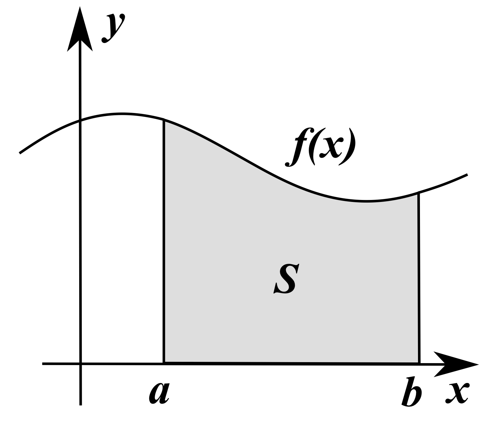
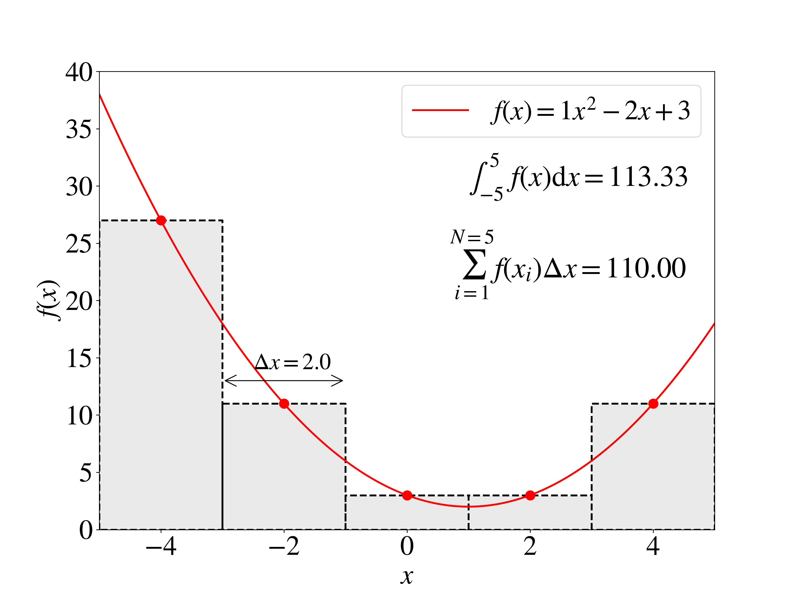
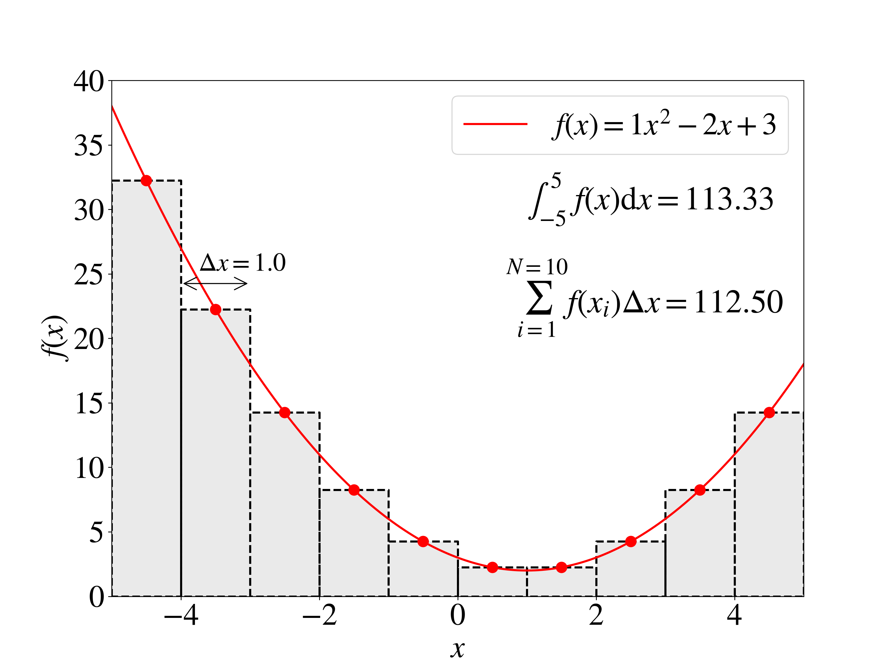
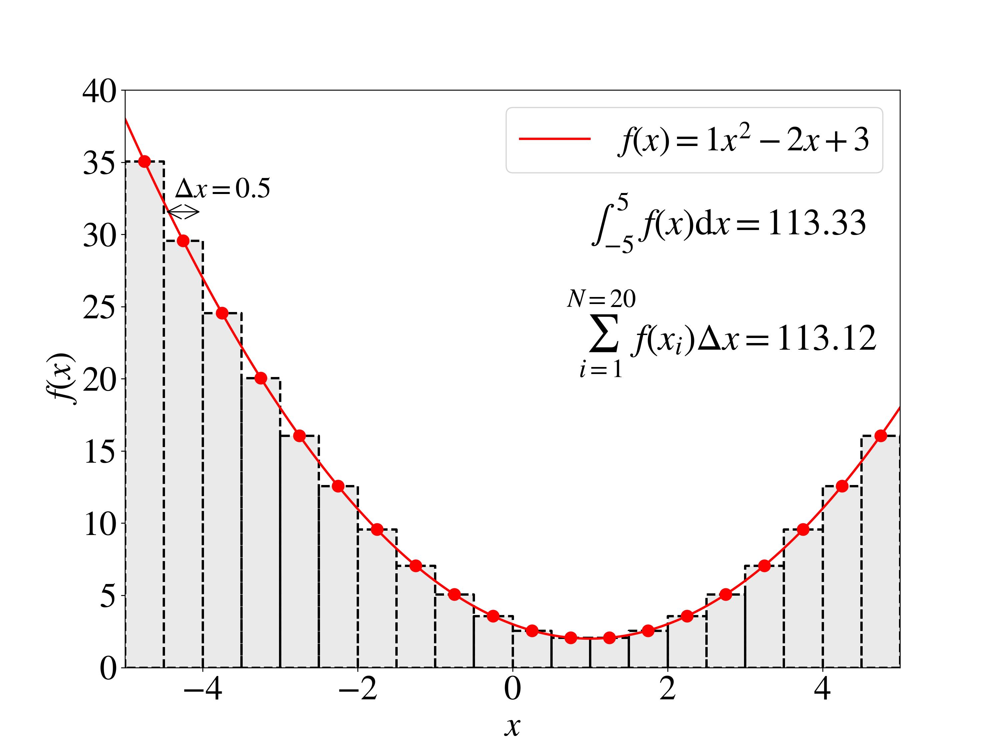
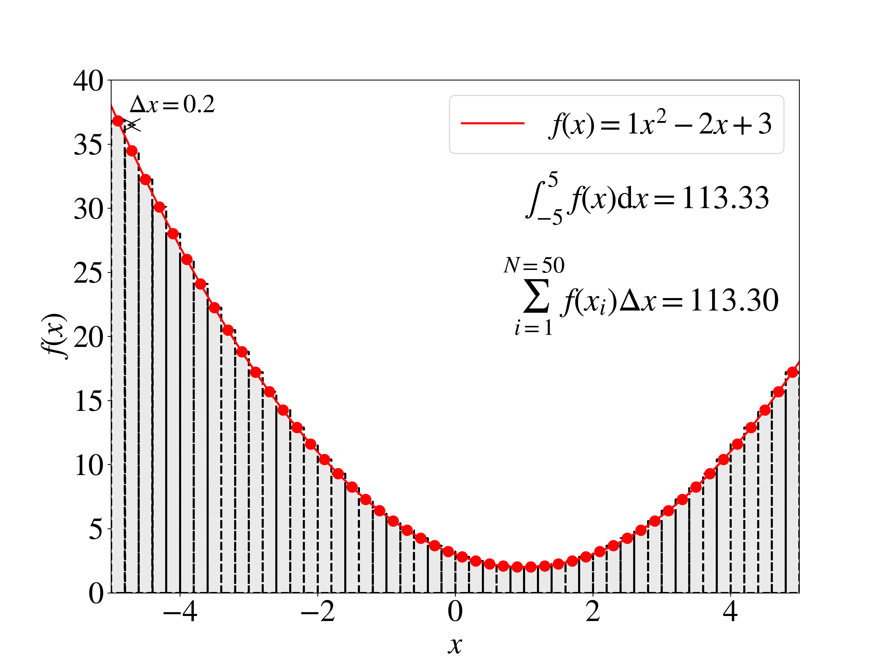

# Numerical integration

Numerical methods are a collection of techniques for solving mathematical problems that lend
themselves to implementation as computer programs. They exist to solve all sorts of problems, for
example differentiation, minimisation, sorting data and solving differential equations.

Many physical systems can be represented by differential equations, but solving them analytically is
only possible in special cases as most non-linear systems of equations do not have analytical
solutions. In order to make numerical predictions it is often necessary to take an approximate
numerical approach to integrating them. These techniques are based around the fact that an integral
can be written as a limit of a "Riemann sum", like this:

$$
\int_{a}^{b} f(x) \, dx \equiv \lim_{N \to \infty} \sum^{N}_{i=1} f\left(x_i\right) \left(\frac{b-a}{N}\right)
$$

Some basic techniques for numerically integrating functions of one variable to obtain approximations
to the true value of the integral are shown in the following sections. Remember that all of these
techniques are *approximations* based on the Riemann sum above but using only a finite number of
terms in the sum.

## Left-Endpoint Rectangle Rule

The left-endpoint rectangle rule is a very simple method for estimating the integral of a function
of one variable (see figure below).

{: width="400" }

The area under the curve is estimated using the function's value at the lower limit of the
integration region, i.e.,

$$
\int_{a}^{b} f(x) \, dx \approx (b-a) f(a)
$$

The accuracy can be improved by simply dividing the interval into $N$ equidistant sub-intervals and
summing up the results from each sub-interval, giving the expression

$$
\int_{a}^{b} f(x) \, dx \approx \sum_{i=1}^{N} h f(x_i)
$$

where $h=(b-a)/N$ and $x_i=a+h(i-1)$.

This is a very simple approximation of an integral and often gives poor results. For example, if
$f(x)$ is a 'monotonically increasing' function, e.g. $f(x) = 1 + 0.5 x$, then the left-endpoint
rectangle rule will always underestimate the integral no matter how many sub-intervals the function
is divided into.

## Mid-Point, or Centre-point, Rectangle Rule

The left-endpoint rectangle rule can be easily improved for many functions by using the function's
value in the middle of the interval rather than a point on the edge of the interval:

$$
\int_{a}^{b} f(x) \, dx \approx (b-a) f(a + (b-a)/2).
$$

as before, subdividing the interval into many sub-intervals will generally improve the approximation
using the same expression as that for the left rectangle rule, but with $x_i=a+h\left(i - \frac{1}{2}\right)$.

As always, the number of sub-intervals needed to obtain an accurate result will depend on how
rapidly the value of the function itself varies.

### Example

In the figures below we see how the accuracy of the mid-point rule increases with the
number of intervals when approximating the integral under a quadratic function:

$$
f(x) = x^2 - 2 x + 3,
$$

which for the integral over the range $-5$ to 5 has the analytical value of

$$
\int_{-5}^{5} \left( x^2 - 2x + 3 \right) \, dx = 113.3333333.
$$

#### 5 intervals

#### 10 intervals

#### 20 intervals

#### 50 intervals

## Trapezium Rule

The trapezium rule states that you can approximate the area under a
curve by a trapezium, as shown in the figure below.

The area is therefore calculated like this:

$$
\int_{x_1}^{x_2} f(x) \, dx \approx  h\left( \frac{1}{2} f(x_1) + \frac{1}{2} f(x_2)\right)
$$

This method is exact for polynomials up to degree 1, i.e., straight
lines, because the area under such functions can be exactly
represented by a trapezium. It is clearly an approximation for higher
order polynomials ($x^2$, $x^3$, etc.) and other functions. The error
will also be small if $h$ is small and vanish in the limit that $h$
tends to zero.

Note that the area of a trapezium is its average height multiplied by its width, i.e.
$\frac{(f(x_1)+f(x_2))}{2}h$.

As with the rectangle rules, to make this rule useful we need to break the curve to be integrated
into many small intervals, e.g., four intervals as shown by

$$
\begin{aligned}
    \int_{x_1}^{x_5} f(x) \, dx & \approx & h \left(\frac{1}{2} f(x_1) + \frac{1}{2} f(x_2)\right) \, \text{region A}  \\
    &&  + h \left(\frac{1}{2} f(x_2) + \frac{1}{2} f(x_3)\right) \, \text{region B} \\
    &&  + h \left(\frac{1}{2} f(x_3) + \frac{1}{2} f(x_4)\right) \, \text{region C} \\
    &&  + h \left(\frac{1}{2} f(x_4) + \frac{1}{2} f(x_5)\right) \,\text{region D} 
\end{aligned}
$$

where $x_1=a$ and $x_5=b$ are the limits of the integral. The figure below illustrates this
approach.

We can generalise this 'extended trapezium' or 'compound trapezium' rule to $N$ trapezia (with boundaries running from $x_1$ to $x_{N+1}$) giving

$$
\begin{aligned}
    \int_{x_1}^{x_{N+1}} f(x) \, dx&\approx h \left[
    \frac{1}{2}f(x_1) + f(x_2) + f(x_3) + \dots + f(x_{N}) + \frac{1}{2}f(x_{N+1}) \right]\\
     &\approx  h \left[ \frac{1}{2}(f(x_1)+f(x_{N+1})) + \sum_{i=2}^{N}f(x_i) \right]
\end{aligned}
$$

where $x_1=a$ and $x_{N+1}=b$ are the limits of the integral.

Note that $h$ is still the width of a single interval, so

$$h=\frac{b-a}{N}.$$

## Accuracy of Numerical Integration

Consider an arbitrary function, $f$, which we want to integrate numerically. We can expand it as a
Taylor series around a 'sampling' point, $x_i$ to obtain

$$
f(x)=f(x_i) + (x-x_i)f'(x_i) + \frac{1}{2}(x-x_i)^{2}f''(x_i)+\dots
$$

where the apostrophe denotes differentiation with respect to $x$.

If we now integrate this expression with respect to $x$ between $x_i$ and the next sampling point
$x_{i+1}$ we obtain

$$
\begin{align}
  \int_{x_i}^{x_{i+1}} f(x) \, dx =& f(x_i)\int_{x_i}^{x_{i+1}} \, dx \nonumber \\
                                &+ f'(x_i)\int_{x_i}^{x_{i+1}}(x-x_i) \, dx \nonumber \\
                                &+ \frac{1}{2}f''(x_i)\int_{x_i}^{x_{i+1}}(x-x_i)^2 \, dx \nonumber \\
                                &+ \dots 
\end{align}
$$

the difference between $x_i$ and $x_{i+1}$ is $h$, so with a little bit of algebra we obtain

$$
 \int_{x_i}^{x_{i+1}} f(x) \, dx = hf(x_i) + \frac{1}{2}h^2f'(x_i)
                                        + \frac{1}{6}h^3f''(x_i)
                                        + \mathcal{O}(h^4)
$$

where the big "$\mathcal{O}$" notation denotes all of the missing higher-order terms starting with the term
proportional to $h^4$.

So we see that in general we can represent our integral as an infinite series in $h$ which we have
to truncate in order to be able to write a practical expression which we can use in our computer
program (or indeed on paper).

If we look at the formulas for the rectangle rule and the trapezium rule we see that they are both
linear in $h$. By comparison to our integrated Taylor series we might assume that the error in all
cases (left-hand rectangle, midpoint and trapezium) will be of order $h^2$. Actually, this is
incorrect. Both the rectangle and trapezium rules when applied to $N$ sub-intervals contain a sum
from $1$ to $N$, and $N$ is inversely proportional to $h$. Hence we would actually expect the error
in all cases to be linear in $h$. I.e., for the rectangle rules we expect that

$$
\int_{x_1}^{x_N} f(x) \, dx = \sum_{i=1}^{N} h f(x_i) + \mathcal{O}(h)
$$

and for the trapezium rule we expect

$$
\int_{x_1}^{x_N} f(x) \, dx= h\left[ \frac{1}{2}(f(x_1)+f(x_N)) + \sum_{i=2}^{N-1}f(x_i) \right] + \mathcal{O}(h)
$$

In fact, the above equation for the rectangle rule error is correct for the left-hand rectangle rule
but not for the mid-point rule, and the above equation for the trapezium rule error is in fact
incorrect for the trapezium rule. For the trapezium rule and for the mid-point rule the dominant
error term is actually of order $h^2$, despite the sum over sub-intervals that we've just discussed.
This arises because the coefficient of the term which is linear in $h$ cancels out in the case of
these two methods.

To see why this is true, we can expand our function as a Taylor series as before, but this time
around the point $x_{i+1}$, to give

$$
f(x)=f(x_{i+1}) + (x-x_{i+1})f'(x_{i+1}) + \frac{1}{2}(x-x_{i+1})^{2}f''(x_{i+1})+\dots
$$ 

When we integrate this expression with respect to $x$ over the same interval as before we obtain 

$$
\begin{align}
\int_{x_i}^{x_{i+1}} f(x) \, dx =& f(x_{i+1})\int_{x_i}^{x_{i+1}} \, dx \nonumber \\
                              & + f'(x_{i+1})\int_{x_i}^{x_{i+1}}(x-x_{i+1}) \, dx \nonumber \\
                              & + \frac{1}{2}f''(x_{i+1})\int_{x_i}^{x_{i+1}}(x-x_{i+1})^2 \, dx \nonumber \\
                              & + \ldots 
\end{align}
$$

It's hopefully obvious that when we evaluate this, some terms will pick up negative signs due to
$(x-x_{i+1})$ being negative in the interval $x_i$ to $x_{i+1}$. In terms of $h$ the result is 

$$
\begin{align}
 \int_{x_i}^{x_{i+1}} f(x) \, dx =& hf(x_{i+1}) \\
                               &- \frac{1}{2}h^2f'(x_{i+1}) \\ 
                               &+ \frac{1}{6}h^3f''(x_{i+1}) \\
                               &+ \mathcal{O}(h^4)
\end{align}
$$

The trapezium rule can be formed from taking the average of the Taylor expansion equations. When we
form this average and introduce the sum over sub-intervals we find that due to the negative sign in
the second Taylor expansion the term linear in $h$ will cancel out, and we obtain

$$
\begin{aligned}
\int_{x_1}^{x_N} f(x) \, dx= h\left[ \frac{1}{2}(f(x_1)+f(x_N)) + \sum_{i=2}^{N-1}f(x_i) \right] + \mathcal{O}(h^{2}) \label{eq:trapezium_righterror}
\end{aligned}
$$

It can be shown that this error term can be written out (approximately) as

$$
\begin{aligned}
\frac{1}{12}h^2\left(f'(x_{1})-f'(x_{N})\right)
\end{aligned}
$$

Recall again that $N$ here is the number of sampling points, not the number of trapezia. Beware that
other texts may use the other convention where $N$ is the number of trapezia and there are $N+1$
sampling points. Don't mix up the two conventions!

The trapezium rule is an example of a "first-order" numerical integration technique. A similar
demonstration can be made for the midpoint rule which is also "first-order". First-order techniques
have errors of the form $\mathcal{O}(h^2)$. In principle one can form higher-order approximations with errors
of the form $\mathcal{O}(h^n)$ for higher values of $n$. Such techniques should in general be better at
approximating an integral compared to the techniques that were presented above, for the same number
of sampling points.

One such higher-order approximation is Simpson's rule (which combines aspects of the trapezium and
mid-point rules), which we quote here for completeness without derivation. It takes the form

$$
\begin{aligned}
\int_{x_1}^{x_{N}} f(x) \, dx \approx \dfrac{h}{3} \left[ f(x_1)+f(x_N) + 4\sum_{i=1}^{N/2}f(x_{1}+(2i-1)h) + 2\sum_{i=1}^{N/2-1}f(x_1+2ih)\right]
\end{aligned}
$$

In general when you are using numerical integration you need to be aware of two sources of error.
The first is the intrinsic error in the technique you are using. This is determined by the 'order'
of the technique, and we have seen above that different techniques will have errors which depend on
different powers of $h$ and hence on different powers of $N$ (the number of sampling points). If the
number of sampling points gets very large then we might also have to worry about 'rounding errors',
due to limits in the precision with which numerical values are held. In general, when using `float`
this source of error should be minimal.
